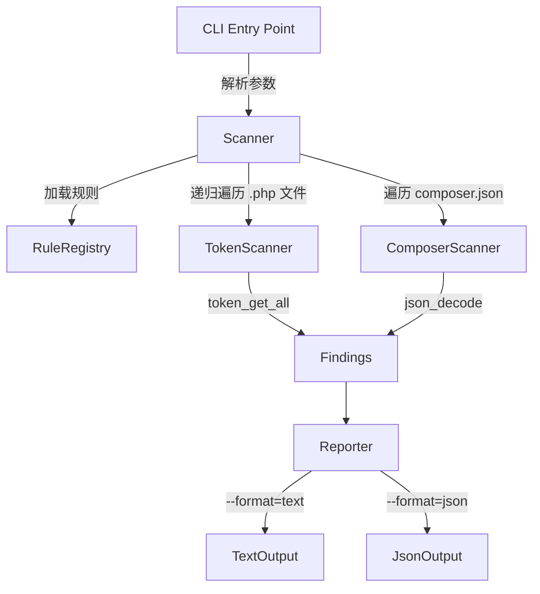

# Design Document

> PHP 8.5 Upgrade — Migration Guide & Check Script — `.kiro/specs/php85-migration-guide/`

---

## Overview

本 spec 交付两个产物：

1. **Migration Guide**（`docs/manual/migration-v3.md`）——面向下游消费者的单文件迁移指南，按模块分章节，覆盖 Phase 0–5 引入的所有 breaking change，每项标注严重程度（🔴/🟡/🟢）并提供 before/after 代码示例
2. **Check Script**（`bin/oasis-http-migrate-v3-check`）——纯 PHP 预升级检查脚本，扫描目标目录检测对已移除/已变更 API 的引用，输出结构化报告

两个产物的内容来源均为 `docs/changes/unreleased/php85-upgrade.md`（Breaking_Change_Record）和 `docs/state/architecture.md`（SSOT），不臆造变更。

**设计原则**：

- Migration Guide 以"下游开发者需要做什么"为组织逻辑，而非"oasis/http 内部改了什么"
- Check Script 采用基于 `token_get_all()` 的 token 级扫描，平衡检测准确性和零依赖约束
- Check Script 的规则注册表（Rule Registry）与扫描引擎解耦，便于后续扩展

---

## Architecture

### Migration Guide 文档架构

Migration Guide 为单文件 `docs/manual/migration-v3.md`，结构如下：

```
migration-v3.md
├── TOC（markdown 锚点导航）
├── 概述（版本变更摘要、适用范围）
├── 快速评估清单（按严重程度汇总所有 breaking change）
├── 模块章节（按 R1 AC4 定义的顺序）
│   ├── 1. PHP Version
│   ├── 2. Dependencies
│   ├── 3. Kernel API
│   ├── 4. DI Container
│   ├── 5. Bootstrap Config
│   ├── 6. Routing
│   ├── 7. Security
│   ├── 8. Middleware
│   ├── 9. Views
│   ├── 10. Twig
│   ├── 11. CORS
│   └── 12. Cookie
├── PHP 语言适配（隐式 nullable、动态属性）
└── 附录：完整 API 变更速查表
```

每个 breaking change 条目遵循统一格式（R2）：

```markdown
### 🔴 条目标题

**影响**：简述影响范围

**Before**:
```php
// 旧用法
```

**After**:
```php
// 新用法
```

**操作**：具体适配步骤
```

### Check Script 架构

Check Script 采用三层架构：Rule Registry → Scanner → Reporter。



#### Rule Registry

规则注册表是一个关联数组，每条规则包含：

| 字段 | 类型 | 说明 |
|------|------|------|
| `id` | string | 规则唯一标识（如 `removed-silex-kernel`） |
| `pattern` | string/array | 检测模式（类名、字符串模式等） |
| `type` | enum | `removed_class` / `changed_api` / `pimple_access` / `old_event` / `old_package` / `guzzle_pattern` |
| `severity` | enum | `🔴` / `🟡` / `🟢` |
| `issue` | string | 问题描述 |
| `action` | string | 建议操作 |

规则分为以下类别：

**Removed_API 规则**（R12 AC3）：

| 规则 ID | 检测目标 | Severity |
|---------|---------|----------|
| `removed-silex-kernel` | `SilexKernel` | 🔴 |
| `removed-silex-app` | `Silex\Application` | 🔴 |
| `removed-pimple-container` | `Pimple\Container` | 🔴 |
| `removed-pimple-provider` | `Pimple\ServiceProviderInterface` | 🔴 |
| `removed-bootable-provider` | `Silex\Api\BootableProviderInterface` | 🔴 |
| `removed-twig-env` | `Twig_Environment` | 🔴 |
| `removed-twig-func` | `Twig_SimpleFunction` | 🔴 |
| `removed-twig-error` | `Twig_Error_Loader` | 🔴 |

**Changed_API 规则**（R12 AC4，CR Q1→统一检测，CR Q2→统一标 🔴）：

| 规则 ID | 检测目标 | Severity |
|---------|---------|----------|
| `changed-auth-policy` | `AuthenticationPolicyInterface` | 🔴 |
| `changed-firewall` | `FirewallInterface` | 🔴 |
| `changed-access-rule` | `AccessRuleInterface` | 🔴 |
| `changed-pre-auth` | `AbstractSimplePreAuthenticator` | 🔴 |
| `changed-pre-auth-user` | `AbstractSimplePreAuthenticateUserProvider` | 🔴 |
| `changed-middleware` | `MiddlewareInterface` | 🔴 |
| `changed-renderer` | `ResponseRendererInterface` | 🔴 |

**Pimple 模式规则**（R12 AC5）：

| 规则 ID | 检测模式 | Severity |
|---------|---------|----------|
| `pimple-access` | `$app['...']` / `$container['...']` 数组式访问 | 🔴 |

**旧 Symfony 事件类规则**（R12 AC6）：

| 规则 ID | 检测目标 | Severity |
|---------|---------|----------|
| `old-event-filter-response` | `FilterResponseEvent` | 🔴 |
| `old-event-get-response` | `GetResponseEvent` | 🔴 |
| `old-event-exception` | `GetResponseForExceptionEvent` | 🔴 |
| `old-event-master-request` | `MASTER_REQUEST` | 🔴 |

**旧包引用规则**（R12 AC7，针对 `composer.json`）：

| 规则 ID | 检测目标 | Severity |
|---------|---------|----------|
| `old-pkg-silex` | `silex/silex` | 🔴 |
| `old-pkg-silex-providers` | `silex/providers` | 🔴 |
| `old-pkg-twig-ext` | `twig/extensions` | 🔴 |

**Guzzle 6.x 模式规则**（R12 AC8，CR Q4→检测构造方式和常见选项名）：

| 规则 ID | 检测模式 | Severity |
|---------|---------|----------|
| `guzzle-exceptions-option` | `'exceptions' => false` / `'exceptions' => true` | 🟡 |
| `guzzle-new-client` | `new Client(` 后跟 Guzzle 6.x 特有选项 | 🟡 |

#### Token Scanner

基于 PHP 内置 `token_get_all()` 进行 token 级扫描，而非纯文本正则匹配。优势：

- 自动跳过注释（`T_COMMENT`、`T_DOC_COMMENT`），减少误报
- 能识别 `use` 语句中的完整命名空间（`T_NAME_QUALIFIED`、`T_NAME_FULLY_QUALIFIED`）
- 能识别 `T_STRING` token 中的类名引用
- 能识别 `$var['key']` 模式（Pimple 访问检测）

扫描流程：

1. 对每个 `.php` 文件调用 `token_get_all()`
2. 遍历 token 序列，对每个 token 检查是否匹配任何规则
3. 匹配时记录 Finding（文件路径、行号、规则 ID、severity、issue、action）

对于 Pimple 访问模式 `$app['...']`，扫描器检测 `T_VARIABLE` + `[` + `T_CONSTANT_ENCAPSED_STRING` 的 token 序列，其中变量名为 `$app` 或 `$container`。

对于 Guzzle 6.x 选项检测（CR Q4→B），扫描器检测字符串 token 中包含 `'exceptions'` 的键值对模式。

#### Composer Scanner

独立于 Token Scanner，专门处理 `composer.json` 文件：

1. 在目标目录中查找所有 `composer.json` 文件
2. `json_decode()` 解析
3. 检查 `require` 和 `require-dev` 中是否引用了已移除的包

#### Reporter

Reporter 接收 Findings 数组，按 Severity_Level 分组排序（🔴 → 🟡 → 🟢），输出报告。

**Text 格式**（默认）：

```
=== 🔴 必须改 (12 findings) ===

src/MyKernel.php:15
  [removed-silex-kernel] 引用了已移除的类 SilexKernel
  → 替换为 MicroKernel，更新构造函数签名

src/MyProvider.php:8
  [removed-pimple-provider] 引用了已移除的接口 Pimple\ServiceProviderInterface
  → 替换为 Symfony CompilerPassInterface / ExtensionInterface

=== 🟡 建议改 (3 findings) ===
...

=== Summary ===
Total: 15 findings
  🔴 必须改: 12
  🟡 建议改: 3
  🟢 可选: 0
```

**JSON 格式**（`--format=json`，R14 AC6）：

```json
[
  {
    "file": "src/MyKernel.php",
    "line": 15,
    "severity": "🔴",
    "issue": "引用了已移除的类 SilexKernel",
    "action": "替换为 MicroKernel，更新构造函数签名"
  }
]
```

---

## Components and Interfaces

### Migration Guide 组件

Migration Guide 本身是纯文档，无代码组件。其内容结构由 R1–R11 定义的模块章节组成。

### Check Script 组件

Check Script 为单文件 PHP 脚本 `bin/oasis-http-migrate-v3-check`，内部按职责划分为以下逻辑组件（均在同一文件中，不拆分为独立类）：

```php
#!/usr/bin/env php
<?php
// ============================================================
// 1. Rule Registry — 规则定义
// ============================================================
function getRules(): array { /* ... */ }

// ============================================================
// 2. CLI — 参数解析与入口
// ============================================================
function main(array $argv): int { /* ... */ }

// ============================================================
// 3. Scanner — 文件遍历与 token 扫描
// ============================================================
function scanDirectory(string $dir, array $rules): array { /* ... */ }
function scanPhpFile(string $file, array $rules): array { /* ... */ }
function scanComposerJson(string $file, array $rules): array { /* ... */ }

// ============================================================
// 4. Reporter — 输出格式化
// ============================================================
function reportText(array $findings, string $targetDir): void { /* ... */ }
function reportJson(array $findings, string $targetDir): void { /* ... */ }

// ============================================================
// 5. Helpers — 工具函数
// ============================================================
function isPhpFile(string $path): bool { /* ... */ }
function isBinaryFile(string $path): bool { /* ... */ }
function isUtf8(string $content): bool { /* ... */ }

main($argv);
```

**设计决策**：单文件而非多类结构，原因：
- C-4 约束要求纯 PHP 脚本，不引入额外依赖
- 脚本通过 `vendor/bin/` 分发，单文件最简单可靠
- 逻辑量有限（预估 300–500 行），不需要类层次结构

### 关键接口定义

**Finding 数据结构**：

```php
// Finding 使用关联数组表示
[
    'file'     => string,  // 相对于目标目录的文件路径
    'line'     => int,     // 行号
    'severity' => string,  // '🔴' | '🟡' | '🟢'
    'issue'    => string,  // 问题描述
    'action'   => string,  // 建议操作
    'rule_id'  => string,  // 规则 ID（内部使用，JSON 输出不包含）
]
```

**Rule 数据结构**：

```php
[
    'id'       => string,
    'type'     => string,  // 'removed_class' | 'changed_api' | 'pimple_access' | 'old_event' | 'old_package' | 'guzzle_pattern'
    'patterns' => array,   // 检测模式列表
    'severity' => string,
    'issue'    => string,
    'action'   => string,
]
```

**CLI 接口**（R14 AC4, AC5）：

```
Usage: oasis-http-migrate-v3-check [options] <directory>

Options:
  --help          显示帮助信息
  --format=FORMAT 输出格式: text (default), json

Arguments:
  directory       要扫描的目标目录路径

Exit codes:
  0  无 🔴 级别问题（或无任何问题）
  1  存在 🔴 级别问题
  2  输入错误（目录不存在等）
```

---

## Data Models

### Breaking_Change_Record → Migration_Guide 章节映射表

此表确保 Migration Guide 覆盖 Breaking_Change_Record 中的所有条目（R1 AC3），无遗漏。

| # | Breaking_Change_Record 条目 | Migration_Guide 章节 | Severity | 关联 Requirement |
|---|---------------------------|---------------------|----------|-----------------|
| 1 | PHP `>=7.0.0` → `>=8.5` | 1. PHP Version | 🔴 | R7 AC6, R11 |
| 2 | 移除 `silex/silex` `^2.3` | 2. Dependencies | 🔴 | R7 AC1 |
| 3 | 移除 `silex/providers` `^2.3` | 2. Dependencies | 🔴 | R7 AC1 |
| 4 | 移除 `twig/extensions` `^1.3` | 2. Dependencies / 10. Twig | 🔴→🟡 | R7 AC1, R8 AC2 |
| 5 | Symfony 全部组件 `^4.0` → `^7.2` | 2. Dependencies | 🔴 | R7 AC2 |
| 6 | `twig/twig` `^1.24` → `^3.0` | 2. Dependencies / 10. Twig | 🔴 | R7 AC3, R8 |
| 7 | `guzzlehttp/guzzle` `^6.3` → `^7.0` | 2. Dependencies | 🔴 | R7 AC4 |
| 8 | `oasis/logging` `^1.1` → `^3.0` | 2. Dependencies | 🔴 | R7 AC5 |
| 9 | `oasis/utils` `^1.6` → `^3.0` | 2. Dependencies | 🔴 | R7 AC5 |
| 10 | `SilexKernel` → `MicroKernel` | 3. Kernel API | 🔴 | R3 AC1–AC5 |
| 11 | `MicroKernel` 构造函数签名变更 | 3. Kernel API | 🔴 | R3 AC3 |
| 12 | `SilexKernel::__set()` 移除 | 3. Kernel API | 🔴 | R3 AC5 |
| 13 | DI 容器 Pimple → Symfony DI | 4. DI Container | 🔴 | R4 AC1–AC3 |
| 14 | `Pimple\ServiceProviderInterface` → `CompilerPassInterface`/`ExtensionInterface` | 4. DI Container / 5. Bootstrap Config | 🔴 | R4 AC2, R9 AC1 |
| 15 | Bootstrap Config `providers` key 语义变更 | 5. Bootstrap Config | 🔴 | R9 AC1 |
| 16 | 路由迁移到 Symfony Routing 7.x | 6. Routing | 🟢 | R10 AC1 |
| 17 | `AuthenticationPolicyInterface` 重写 | 7. Security | 🔴 | R5 AC1 |
| 18 | `FirewallInterface` 重写 | 7. Security | 🔴 | R5 AC2 |
| 19 | `AccessRuleInterface` 重写 | 7. Security | 🔴 | R5 AC3 |
| 20 | `AbstractSimplePreAuthenticator` → `AbstractPreAuthenticator` | 7. Security | 🔴 | R5 AC4 |
| 21 | `AbstractSimplePreAuthenticateUserProvider` 适配 | 7. Security | 🔴 | R5 AC5 |
| 22 | `MiddlewareInterface::before()` 签名变更 | 8. Middleware | 🔴 | R6 AC1 |
| 23 | `AbstractMiddleware` 移除 Silex 依赖 | 8. Middleware | 🔴 | R6 AC2 |
| 24 | 事件优先级常量变更 | 8. Middleware | 🔴 | R6 AC3 |
| 25 | View Handler / `ResponseRendererInterface` 类型参数变更 | 9. Views | 🔴 | R10 AC4 |
| 26 | Twig 类名变更（`Twig_Environment` 等） | 10. Twig | 🔴 | R8 AC1 |
| 27 | `SimpleTwigServiceProvider` 重写 | 10. Twig | 🔴 | R8 AC3 |
| 28 | CORS Provider → EventSubscriber | 11. CORS | 🟢 | R10 AC2 |
| 29 | Cookie Provider → EventSubscriber | 12. Cookie | 🟢 | R10 AC3 |
| 30 | 隐式 nullable 参数修复 | PHP 语言适配 | 🟡 | R11 AC1 |
| 31 | 动态属性废弃 | PHP 语言适配 | 🟡 | R11 AC2 |
| 32 | 旧 Symfony 事件类移除 | 8. Middleware（交叉引用） | 🔴 | R6 AC3 |
| 33 | `NullEntryPoint` 适配 | 7. Security（内部变更） | 🟢 | R10 AC5 |
| 34 | `phpunit/phpunit` `^5.2` → `^13.0` | 附录（开发依赖参考） | 🟢 | — |
| 35 | `phpstan/phpstan` 新增 `^2.1` | 附录（开发依赖参考） | 🟢 | — |

**说明**：
- 条目 34–35 为开发依赖变更，不影响下游运行时代码，在附录中作为参考信息列出（🟢 可选）
- 条目 4 在 Dependencies 章节标 🔴（包移除），在 Twig 章节标 🟡（替代方案说明）
- 条目 28–29、33 的公共 API 保持不变，Migration Guide 明确说明无需下游操作（R10 AC5）

### Bootstrap_Config Key 参考表

此表对应 R9 AC2，列出所有 Bootstrap_Config key 的变更状态：

| Key | 类型 | 默认值 | 是否变更 | 变更说明 |
|-----|------|--------|---------|---------|
| `routing` | array | — | ❌ 不变 | 行为保持不变 |
| `security` | array | — | ❌ 不变 | 结构不变，内部 policy 接口已重写 |
| `cors` | array | — | ❌ 不变 | 行为保持不变 |
| `twig` | array | — | ❌ 不变 | 行为保持不变 |
| `twig.strict_variables` | bool | `true` | ❌ 不变 | — |
| `twig.auto_reload` | bool/null | `null` | ❌ 不变 | — |
| `middlewares` | array | `[]` | ❌ 不变 | 元素类型 `MiddlewareInterface` 签名已变更 |
| `providers` | array | `[]` | ✅ **语义变更** | 从 `Pimple\ServiceProviderInterface` 改为 `CompilerPassInterface`/`ExtensionInterface` |
| `view_handlers` | array | `[]` | ❌ 不变 | — |
| `error_handlers` | array | `[]` | ❌ 不变 | — |
| `injected_args` | array | `[]` | ❌ 不变 | — |
| `trusted_proxies` | array | `[]` | ❌ 不变 | — |
| `trusted_header_set` | int | — | ❌ 不变 | — |
| `behind_elb` | bool | `false` | ❌ 不变 | — |
| `trust_cloudfront_ips` | bool | `false` | ❌ 不变 | — |
| `cache_dir` | string/null | `null` | ❌ 不变 | — |

### Check Script 退出码模型

| 退出码 | 含义 | 触发条件 |
|--------|------|---------|
| 0 | 通过 | 无 🔴 级别 finding（可能有 🟡/🟢） |
| 1 | 失败 | 存在至少一个 🔴 级别 finding |
| 2 | 输入错误 | 目标目录不存在、参数错误等 |


---

## Correctness Properties

*A property is a characteristic or behavior that should hold true across all valid executions of a system — essentially, a formal statement about what the system should do. Properties serve as the bridge between human-readable specifications and machine-verifiable correctness guarantees.*

本 spec 的两个产物中，Migration Guide 是纯文档，Check Script 是纯 PHP 脚本。PBT 主要适用于 Check Script 的扫描逻辑（纯函数、输入空间大、行为随输入变化）。Migration Guide 的结构性属性也可通过 PBT 验证（解析 markdown 后检查结构约束）。

### Property 1: TOC 锚点完整性

*For any* anchor link in the Migration_Guide TOC section, there SHALL exist a corresponding heading in the document body whose generated anchor matches the link target.

**Validates: Requirements 1.2**

### Property 2: Breaking Change 覆盖完整性

*For any* breaking change item recorded in Breaking_Change_Record (`docs/changes/unreleased/php85-upgrade.md`), the Migration_Guide SHALL contain a section or entry that addresses that item.

**Validates: Requirements 1.3**

### Property 3: 条目格式完整性

*For any* breaking change entry in the Migration_Guide, the entry SHALL contain all three required elements: (1) a Severity_Level marker (🔴/🟡/🟢), (2) a before/after code example pair, and (3) an action description.

**Validates: Requirements 2.1, 2.2, 2.3**

### Property 4: Bootstrap_Config Key 覆盖完整性

*For any* Bootstrap_Config key defined in `docs/state/architecture.md`, the Migration_Guide's Bootstrap_Config key reference table SHALL contain an entry for that key.

**Validates: Requirements 9.2**

### Property 5: 规则检测完整性

*For any* PHP file containing a reference to a pattern registered in the Rule Registry (Removed_API class name, Changed_API interface name, Pimple access pattern, old Symfony event class, or Guzzle 6.x pattern), and *for any* `composer.json` file containing a removed package reference, the Check_Script scanner SHALL produce at least one Finding for that file.

**Validates: Requirements 12.3, 12.4, 12.5, 12.6, 12.7, 12.8**

### Property 6: 递归扫描完整性

*For any* directory structure containing `.php` files at arbitrary nesting depths, the Check_Script SHALL discover and scan every `.php` file in the tree.

**Validates: Requirements 12.2**

### Property 7: Finding 字段完整性

*For any* Finding produced by the Check_Script, the Finding SHALL contain all four required fields: file path (relative to target directory), line number (positive integer), issue description (non-empty string), and suggested action (non-empty string).

**Validates: Requirements 13.2**

### Property 8: Severity 分组排序

*For any* set of Findings with mixed Severity_Levels, the text output SHALL group all 🔴 findings before all 🟡 findings, and all 🟡 findings before all 🟢 findings.

**Validates: Requirements 13.3**

### Property 9: 退出码正确性

*For any* scan result, the Check_Script exit code SHALL be 1 if and only if at least one Finding has Severity_Level 🔴; otherwise the exit code SHALL be 0.

**Validates: Requirements 13.6**

### Property 10: 输出格式有效性

*For any* set of Findings, when `--format=json` is specified, the output SHALL be valid JSON, parseable as an array, and each element SHALL contain the fields `file`, `line`, `severity`, `issue`, and `action`.

**Validates: Requirements 14.5, 14.6**

### Property 11: 二进制文件与非 UTF-8 文件容错

*For any* directory containing a mix of valid PHP files, binary files, and non-UTF-8 encoded files, the Check_Script SHALL complete without error, skip non-scannable files, and still produce correct Findings for the valid PHP files.

**Validates: Requirements 15.3**

---

## Error Handling

### Check Script 错误处理

| 错误场景 | 处理方式 | 退出码 | 关联 Requirement |
|---------|---------|--------|-----------------|
| 目标目录不存在 | 输出 `Error: Directory 'xxx' does not exist.` 到 stderr，立即退出 | 2 | R15 AC1 |
| 无命令行参数 | 输出 usage 帮助信息到 stderr，立即退出 | 2 | R14 AC4 |
| 无效的 `--format` 值 | 输出 `Error: Unsupported format 'xxx'. Use 'text' or 'json'.` 到 stderr，立即退出 | 2 | R14 AC5 |
| 目标目录无 `.php` 文件 | 输出提示信息 `No PHP files found in 'xxx'.`，正常退出 | 0 | R15 AC2 |
| 文件无读取权限 | 输出 warning `Warning: Cannot read file 'xxx', skipping.` 到 stderr，继续扫描 | 不影响 | R15 AC5 |
| 文件为二进制文件 | 静默跳过，不输出 warning | 不影响 | R15 AC3 |
| 文件非 UTF-8 编码 | 静默跳过，不输出 warning | 不影响 | R15 AC3 |
| `token_get_all()` 解析失败 | 输出 warning `Warning: Failed to tokenize 'xxx', skipping.` 到 stderr，继续扫描 | 不影响 | R15 AC3 |
| `composer.json` JSON 解析失败 | 输出 warning `Warning: Invalid JSON in 'xxx', skipping.` 到 stderr，继续扫描 | 不影响 | R15 AC3 |
| 符号链接循环 | 使用 `realpath()` 去重，已访问的路径不再扫描 | 不影响 | R15 AC4 |

### Migration Guide 错误处理

Migration Guide 为纯文档，无运行时错误处理。内容正确性通过以下机制保障：

- 映射表（Data Models 章节）确保覆盖完整性
- Correctness Properties 1–4 提供自动化验证
- 人工 review 确认技术准确性

---

## Testing Strategy

### 测试分层

本 spec 的测试分为三层：

| 层级 | 目标 | 工具 | 覆盖范围 |
|------|------|------|---------|
| Property-Based Tests | Check Script 核心扫描逻辑 | Eris（`giorgiosironi/eris`） | Properties 5–11 |
| Unit Tests | Check Script 各函数的具体行为 | PHPUnit | 边缘情况、具体示例 |
| Document Validation Tests | Migration Guide 结构完整性 | PHPUnit（解析 markdown） | Properties 1–4 |

### Property-Based Tests（PBT）

PBT 适用于 Check Script 的扫描逻辑，因为：
- 扫描函数是纯函数（输入：文件内容 + 规则集 → 输出：Findings 数组）
- 输入空间大（任意 PHP 文件内容、任意目录结构）
- 行为随输入变化（不同的 API 引用组合产生不同的 Findings）

**PBT 配置**：
- 库：`giorgiosironi/eris`（项目已有依赖）
- 最小迭代次数：100 次
- 每个 property test 对应一个 Correctness Property
- Tag 格式：`Feature: php85-migration-guide, Property {number}: {property_text}`

**PBT 测试文件**：`ut/PBT/MigrateCheckPropertyTest.php`

**生成器策略**：

| Property | 生成器 | 说明 |
|----------|--------|------|
| P5 规则检测 | 生成包含随机 Removed_API/Changed_API 引用的 PHP 文件内容 | 从规则注册表中随机选择 1–N 条规则，生成包含对应模式的 PHP 代码片段 |
| P6 递归扫描 | 生成随机深度（1–5 层）的目录结构，随机放置 `.php` 文件 | 使用临时目录，验证发现的文件数等于放置的文件数 |
| P7 Finding 字段 | 复用 P5 的生成器，检查每个 Finding 的字段 | — |
| P8 Severity 排序 | 生成包含混合 severity 规则匹配的文件集 | 验证输出中 🔴 section 在 🟡 之前，🟡 在 🟢 之前 |
| P9 退出码 | 生成有/无 🔴 finding 的随机场景 | 验证退出码与 🔴 存在性的一致性 |
| P10 JSON 格式 | 复用 P5 的生成器，使用 `--format=json` | `json_decode()` 验证有效性，检查字段存在性 |
| P11 二进制容错 | 生成混合二进制和 PHP 文件的目录 | 验证不崩溃且 PHP 文件的 Findings 正确 |

### Unit Tests

Unit tests 覆盖 PBT 不适合的具体场景：

| 测试 | 覆盖 AC | 说明 |
|------|---------|------|
| 目录不存在 → exit code 2 | R15 AC1 | 边缘情况 |
| 空目录 → exit code 0 | R15 AC2 | 边缘情况 |
| `--help` 输出 | R14 AC4 | 具体行为 |
| 符号链接循环处理 | R15 AC4 | 边缘情况 |
| 文件权限错误 → warning + 继续 | R15 AC5 | 边缘情况 |
| 无 🔴 finding → exit code 0 | R13 AC5, R13 AC6 | 具体示例 |
| 已知 API 引用的检测 | R12 AC3–AC8 | 具体示例验证 |

**Unit Test 文件**：`ut/MigrateCheckScriptTest.php`

### Document Validation Tests

验证 Migration Guide 的结构完整性（Properties 1–4）：

| 测试 | 覆盖 Property | 说明 |
|------|--------------|------|
| TOC 锚点解析 | P1 | 解析 TOC 中的 `[text](#anchor)` 链接，验证每个 anchor 对应一个 heading |
| Breaking change 覆盖 | P2 | 解析 `php85-upgrade.md` 提取条目，验证每个条目在 `migration-v3.md` 中有对应内容 |
| 条目格式检查 | P3 | 解析每个 breaking change entry，验证包含 severity marker + code blocks + action |
| Config key 覆盖 | P4 | 解析 `architecture.md` 提取 Bootstrap_Config keys，验证每个 key 在参考表中出现 |

**Document Validation Test 文件**：`ut/MigrationGuideValidationTest.php`

注意：Properties 1–4 虽然形式上是 property，但其输入空间固定（特定文档文件），实际上是 example-based 验证。不使用 Eris PBT 框架，而是作为普通 PHPUnit 测试实现。

---

## Impact Analysis

### 受影响的 state 文档

| 文件 | 受影响 Section | 影响说明 |
|------|---------------|---------|
| `docs/state/architecture.md` | 无变更 | 本 spec 不修改架构，仅基于 SSOT 编写迁移文档和检查脚本 |

本 spec 的两个产物（Migration Guide 和 Check Script）是新增文件，不修改任何现有 state 文档或源代码。

### 现有行为变化

- **无**。本 spec 不修改 `oasis/http` 的任何运行时行为。Migration Guide 是纯文档，Check Script 是独立的只读扫描工具。

### 数据模型变更

- **不涉及**。本 spec 不引入或修改任何数据模型。

### 外部系统交互

- **不涉及**。Check Script 仅读取本地文件系统，不与外部系统交互。

### 配置项变更

| 配置文件 | 变更 | 说明 |
|---------|------|------|
| `composer.json` | 新增 `"bin"` 条目 | 添加 `"bin/oasis-http-migrate-v3-check"` 以暴露脚本到 `vendor/bin/`。不影响现有功能，仅新增分发入口 |

### 新增文件

| 文件 | 说明 |
|------|------|
| `docs/manual/migration-v3.md` | Migration Guide 文档（新增） |
| `bin/oasis-http-migrate-v3-check` | 预升级检查脚本（新增） |

### Graphify 辅助分析

基于 graphify GRAPH_REPORT，`MicroKernel` 是系统的 god node（42 edges），跨越 Bootstrap & Routing Integration、Security Auth Controllers、Middleware Chain 等多个 community。本 spec 的 Migration Guide 和 Check Script 覆盖了 `MicroKernel` 关联的所有主要 community 的 breaking change：

- Community 1 (Bootstrap & Routing Integration) → R3 Kernel API、R9 Bootstrap Config、R10 Routing
- Community 0/5 (Security) → R5 Security
- Community 12/20 (Middleware) → R6 Middleware
- Community 13 (Pre-Authenticator Framework) → R5 AC4–AC6
- Community 10/11 (View Handler) → R10 AC4
- Community 14 (Cookie) → R10 AC3
- Community 1 (Twig) → R8 Twig

未发现遗漏的跨 community 连锁影响。

---

## Socratic Review

**Q: Check Script 为什么选择 `token_get_all()` 而非正则匹配？**
A: `token_get_all()` 是 PHP 内置函数，零依赖，能自动跳过注释中的类名引用（减少误报），能识别完整的命名空间引用（如 `Pimple\ServiceProviderInterface`）。正则匹配无法可靠区分注释和代码，且处理命名空间时容易出错。`token_get_all()` 的性能对于检查脚本的使用场景完全足够。

**Q: Check Script 为什么是单文件而非多类结构？**
A: C-4 约束要求纯 PHP 脚本，不引入额外依赖。单文件通过 `vendor/bin/` 分发最简单可靠，不需要 autoloader。脚本逻辑量有限（预估 300–500 行），不需要类层次结构。如果未来规则数量显著增长，可以考虑拆分为多文件并使用 `require`。

**Q: Changed_API 统一标 🔴 是否会导致误报？**
A: CR Q2 决策明确：Changed_API 引用统一标 🔴，因为实现了旧签名的代码必然报错。这确实可能对"仅引用但未实现"的代码产生误报（如 `instanceof` 检查），但误报优于漏报——下游开发者看到 🔴 标记后会检查代码，发现无需修改时可忽略。Check Script 的定位是"影响评估"而非"精确诊断"。

**Q: Guzzle 6.x 检测的 `'exceptions' => false` 模式是否可靠？**
A: CR Q4→B 决策限定了检测范围：`new Client()` 构造方式和常见 6.x 选项名（如 `'exceptions' => false`）。这些模式在 Guzzle 7.x 中已移除或行为变化，检测它们是合理的。但 token 级扫描可能在字符串上下文中误匹配（如配置数组中的 `'exceptions'` 键名恰好出现在非 Guzzle 上下文中）。标记为 🟡 而非 🔴 反映了这种不确定性。

**Q: Migration Guide 的 Document Validation Tests 是否属于过度测试？**
A: 不是。Migration Guide 是面向下游消费者的关键文档，结构完整性直接影响可用性。自动化验证（TOC 锚点、breaking change 覆盖、条目格式）能在文档更新时防止回归。这些测试的实现成本低（解析 markdown 文本），但价值高（防止遗漏 breaking change 或格式不一致）。

**Q: Properties 1–4 为什么不用 Eris PBT？**
A: Properties 1–4 的输入空间是固定的（特定文档文件），不存在"随机生成输入"的场景。它们本质上是 example-based 的结构验证，用普通 PHPUnit 断言即可。Eris PBT 适用于输入空间大且行为随输入变化的场景（如 Properties 5–11 的 Check Script 扫描逻辑）。

**Q: Check Script 的 Pimple 访问检测 `$app['...']` 是否会误报？**
A: 会。任何名为 `$app` 的变量的数组访问都会被标记，即使它不是 Pimple 容器。但在 `oasis/http` 下游项目的上下文中，`$app` 几乎总是指 Pimple 容器（这是 Silex 的惯例）。误报率预计很低，且标记为 🔴 是合理的——如果下游代码中有 `$app['...']` 模式，开发者应该检查它是否是 Pimple 访问。

**Q: Design 是否覆盖了所有 15 条 Requirements 的 AC？**
A: 是。映射关系如下：
- R1（文档结构）→ Architecture: Migration Guide 文档架构
- R2（条目格式）→ Architecture: 条目格式定义
- R3（Kernel API）→ Data Models: 映射表 #10–12
- R4（DI Container）→ Data Models: 映射表 #13–14
- R5（Security）→ Data Models: 映射表 #17–21
- R6（Middleware）→ Data Models: 映射表 #22–24, 32
- R7（Dependencies）→ Data Models: 映射表 #1–9
- R8（Twig）→ Data Models: 映射表 #4, 6, 26–27
- R9（Bootstrap Config）→ Data Models: Bootstrap_Config Key 参考表, 映射表 #15
- R10（Routing/CORS/Cookie/Views）→ Data Models: 映射表 #16, 25, 28–29, 33
- R11（PHP 语言适配）→ Data Models: 映射表 #30–31
- R12（Check Script 扫描）→ Architecture: Rule Registry + Token Scanner + Composer Scanner
- R13（输出格式）→ Architecture: Reporter
- R14（分发集成）→ Components: CLI 接口
- R15（健壮性）→ Error Handling

**Q: CR 四项决策是否已体现在 design 中？**
A: 是。
- CR Q1（Changed_API 统一检测）→ Rule Registry: Changed_API 规则表，所有 Changed_API 统一检测引用即标记
- CR Q2（Changed_API 引用统一标 🔴）→ Rule Registry: Changed_API 规则 Severity 均为 🔴
- CR Q3（仅约束外部行为）→ Components: CLI 接口定义了 `vendor/bin/` 可访问性，不规定 `composer.json` 具体修改方式
- CR Q4（Guzzle 检测包括构造方式和选项名）→ Rule Registry: `guzzle-exceptions-option` 和 `guzzle-new-client` 规则


---

## Gatekeep Log

**校验时间**: 2025-07-15
**校验结果**: ⚠️ 已修正后通过

### 修正项
- [结构] 补充缺失的 `## Impact Analysis` section，覆盖受影响的 state 文档、现有行为变化、数据模型变更、外部系统交互、配置项变更、新增文件，并利用 graphify GRAPH_REPORT 辅助验证 breaking change 覆盖范围与 community 结构的一致性

### 合规检查
- [x] 无 TBD / TODO / 待定 / 占位符
- [x] 无空 section 或不完整的列表
- [x] 内部引用一致（requirements 编号、术语引用与 requirements.md Glossary 一致）
- [x] 代码块语法正确（语言标注、闭合）
- [x] 无 markdown 格式错误
- [x] 一级标题存在（`# Design Document`）
- [x] 技术方案主体存在（Architecture section），承接 requirements 中的需求
- [x] 接口签名 / 数据模型有明确定义（Finding、Rule 数据结构、CLI 接口）
- [x] 各 section 之间使用 `---` 分隔
- [x] 每条 requirement（R1–R15）在 design 中都有对应的实现描述（Socratic Review 最后一条 Q&A 提供了完整映射）
- [x] 无遗漏的 requirement（错误处理 R15 在 Error Handling section 完整覆盖）
- [x] design 中的方案不超出 requirements 的范围
- [x] Impact Analysis 覆盖所有必要维度（state 文档、行为变化、数据模型、外部系统、配置项）
- [x] graphify 辅助验证了 breaking change 覆盖范围与 community 结构的一致性
- [x] 技术选型有明确理由（token_get_all vs 正则、单文件 vs 多类、Eris PBT vs example-based）
- [x] 接口签名足够清晰，能让 task 独立执行
- [x] 与 state 文档中描述的现有架构一致（Bootstrap_Config Key 参考表与 architecture.md 完全对应）
- [x] 无过度设计
- [x] Socratic Review 覆盖充分（8 个 Q&A，含 requirements 覆盖、CR 决策体现、技术选型理由）
- [x] Requirements CR 四项决策均已在 design 中体现
- [x] Breaking_Change_Record 映射表覆盖完整（35 条，含开发依赖参考）
- [x] 可 task 化：产物边界清晰（Migration Guide + Check Script），模块间无循环依赖

### Clarification Round

**状态**: ✅ 已回答

**Q1:** Design 中 Check Script 的测试分为 PBT（`ut/PBT/MigrateCheckPropertyTest.php`）和 Unit Test（`ut/MigrateCheckScriptTest.php`）两个文件。Check Script 是单文件脚本（函数式，非 class），测试需要 `require` 脚本文件来调用内部函数。实现时是否需要将脚本中的函数提取为可独立 `require` 的文件（如 `bin/migrate-check-functions.php`），还是直接在测试中 `require` 脚本入口文件并通过条件守卫（如 `if (PHP_SAPI === 'cli' && ...)`）避免 `main()` 自动执行？

**A:** A 或 B 均可，实现时自行选择。优先 A（提取函数文件）如果更清晰，否则 B（条件守卫）也可接受。

**Q2:** Migration Guide 和 Check Script 是两个独立产物。Tasks 拆分时，是按产物维度拆分（先完成整个 Migration Guide，再完成整个 Check Script），还是按功能切片拆分（如先做 Rule Registry + 对应的 Migration Guide 章节，再做 Scanner + 对应章节）？

**A:** A) 按产物拆分：Migration Guide 全部章节为一组 tasks，Check Script 为另一组 tasks

**Q3:** Document Validation Tests（`ut/MigrationGuideValidationTest.php`）需要解析 `migration-v3.md` 和 `php85-upgrade.md` 来验证覆盖完整性。这些测试应在 Migration Guide 编写完成后作为独立 task 实现，还是与 Migration Guide 编写 task 合并（边写边测）？

**A:** C) 先写测试骨架（红灯），再写 Migration Guide 使测试通过（TDD 风格）

**Q4:** Check Script 的 PBT 生成器需要生成包含特定 API 引用的 PHP 文件内容。生成策略是使用简单的字符串模板拼接（如 `"<?php\nuse " . $className . ";\n"`），还是使用更结构化的方式（如维护一组 PHP 代码片段模板）？

**A:** C) 混合方式：简单规则用模板拼接，复杂模式（如 Pimple 访问、Guzzle 选项）用预定义片段
