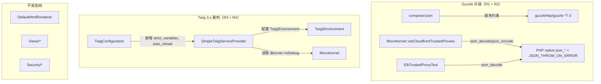

# Design Document

> PHP 8.5 Upgrade — Phase 2: Twig & HTTP Client Upgrade — `.kiro/specs/php85-phase2-twig-guzzle-upgrade/`

---

## Overview

本 design 描述如何将 `guzzlehttp/guzzle` 从 `^6.3` 升级到 `^7.0`，替换已移除的 Guzzle JSON 辅助函数，并重构 Twig 相关代码以利用 Twig 3.x 特性。核心思路：

1. **Guzzle 版本升级**：`composer.json` 中 `guzzlehttp/guzzle` 约束从 `^6.3` 改为 `^7.0`，保持使用 `GuzzleHttp\Client` 具体类及其便捷方法（`$client->request()`），不迁移到 PSR-18 接口
2. **JSON 辅助函数替换**：所有 `\GuzzleHttp\json_decode()` / `\GuzzleHttp\json_encode()` 替换为 PHP 原生 `json_decode()` / `json_encode()` + `JSON_THROW_ON_ERROR`，保持解析失败时抛异常的行为语义
3. **Twig 3.x 特性重构**：在 `SimpleTwigServiceProvider` 中启用 `strict_variables`（默认 `true`）和 `auto_reload`（debug 模式下自动开启），在 `TwigConfiguration` 中新增对应配置项
4. **测试适配**：更新所有受影响的测试文件，确保 `twig`、`aws`、`configuration` suite 通过

**关键决策**（来自 requirements CR）：

- 不迁移到 PSR-18 接口编程，保持 Guzzle `Client` 具体类（goal Q3 → A）
- `strict_variables` 默认 `true`，发现模板问题时修复模板（requirements CR Q2 → A）
- `auto_reload` 的 auto-detect 通过 `$kernel->isDebug()` 实现，provider 已接受 `$kernel` 参数（requirements CR Q3 → A）


---

## Architecture

本 Phase 的变更集中在两个独立的子系统上，不涉及架构层面的重构。

### 变更拓扑




---

## Impact Analysis

### 受影响的 state 文档

| 文档 | Section | 影响 |
|------|---------|------|
| `docs/state/architecture.md` | Bootstrap Config 结构 | `twig` key 下新增 `strict_variables`、`auto_reload` 两个配置项，应在 Phase 2 tasks 完成后更新 state 文档。注意：该文档仍引用 `SilexKernel`（Phase 1 遗留），但 state 文档的全面更新不在本 Phase scope 内，仅需补充 twig 配置项变更。 |

### 受影响的模块与 community

基于知识图谱（`graphify-out/GRAPH_REPORT.md`），`MicroKernel` 是系统的 god node（41 edges），但本 Phase 仅修改其 `setCloudfrontTrustedProxies()` 方法中的 JSON 函数调用，不涉及核心初始化流程。Twig 相关变更局限于 Community 2（Bootstrap Integration Tests）和 Community 6（Configuration Validation）。

### 现有行为变化

- **JSON 解析错误异常类型**：`\InvalidArgumentException` → `\JsonException`。当前所有 catch 块使用 `\Throwable`，行为不变。详见 Error Handling section。
- **Twig strict_variables**：新增默认启用的严格变量检查。现有模板和测试中所有变量均已正确传入，不影响现有行为。
- **Twig auto_reload**：新增 auto-detect 逻辑（debug 模式下自动开启）。此前 Twig 未设置 `auto_reload`（Twig 默认为 `false`），debug 模式下行为有变化（模板修改后自动重新编译），但这是预期的开发体验改进。

### 数据模型变更

不涉及。TwigConfiguration 配置树扩展是向后兼容的——不传入新配置项时使用默认值，现有 Bootstrap_Config 无需修改。

### 外部系统交互

不涉及。Guzzle Client 的使用模式（`new Client([...])` + `$client->request()`）在 Guzzle 7 中保持兼容。

### 配置项变更

| 配置项 | 变更类型 | 默认值 | 向后兼容 |
|--------|----------|--------|----------|
| `twig.strict_variables` | 新增 | `true` | ✅ 不传入时使用默认值 |
| `twig.auto_reload` | 新增 | `null`（auto-detect） | ✅ 不传入时使用默认值 |

### 需要修改的文件

| 文件 | 变更类型 | 关联 Requirement |
|------|----------|-----------------|
| `composer.json` | 版本约束更新 | R1 |
| `src/MicroKernel.php` | JSON 函数替换（3 处） | R2 |
| `src/Configuration/TwigConfiguration.php` | 新增 `strict_variables`、`auto_reload` 配置项 | R4 |
| `src/ServiceProviders/Twig/SimpleTwigServiceProvider.php` | 读取新配置项，设置 Twig Environment options | R4 |
| `ut/AwsTests/ElbTrustedProxyTest.php` | JSON 函数替换（12 处 `json_decode`） | R2 |
| `ut/Configuration/TwigConfigurationTest.php` | 新增 `strict_variables`、`auto_reload` 测试 | R5 |
| `ut/Twig/TwigServiceProviderTest.php` | 新增 Twig 3.x 特性验证测试 | R5 |

### 不受影响的文件

| 文件 | 原因 |
|------|------|
| `src/Views/DefaultHtmlRenderer.php` | 已使用 `Twig\Error\LoaderError`（Twig 3.x 异常类），无需修改 |
| `src/Views/*.php`（其余） | 不依赖 Guzzle 或 Twig 配置 |
| `src/ServiceProviders/Security/*` | 不在本 Phase scope 内 |
| `src/Configuration/*`（除 TwigConfiguration） | 不涉及 Twig 或 Guzzle |
| `ut/Twig/templates/*.twig` | 现有模板已兼容 Twig 3.x 语法（见 Components §3 验证） |

---

## Components and Interfaces

### 1. Guzzle 版本升级（R1）

**变更**：`composer.json` 中 `guzzlehttp/guzzle` 从 `^6.3` 改为 `^7.0`。

Guzzle 7 的主要 breaking changes：
- 移除 `functions.php` 中的辅助函数（`\GuzzleHttp\json_decode()`、`\GuzzleHttp\json_encode()` 等）
- 构造函数参数和异常类有细微变化，但 `new Client([...])` + `$client->request()` 的使用模式保持兼容

当前代码中 `MicroKernel::setCloudfrontTrustedProxies()` 使用的 `new Client(['base_uri' => ..., 'timeout' => ...])` + `$client->request('GET', ...)` 模式在 Guzzle 7 中完全兼容，无需修改。

### 2. JSON 辅助函数替换（R2）

**替换规则**：

| 原调用 | 替换为 |
|--------|--------|
| `\GuzzleHttp\json_decode($content, true)` | `\json_decode($content, true, 512, JSON_THROW_ON_ERROR)` |
| `\GuzzleHttp\json_encode($data, JSON_PRETTY_PRINT)` | `\json_encode($data, JSON_PRETTY_PRINT \| JSON_THROW_ON_ERROR)` |

**行为等价性分析**：

- Guzzle 6 的 `json_decode()` 在解析失败时抛出 `\InvalidArgumentException`
- PHP 原生 `json_decode()` + `JSON_THROW_ON_ERROR` 在解析失败时抛出 `\JsonException`
- 异常类型不同，但当前代码中所有 catch 块使用 `\Throwable`，因此异常类型变化不影响现有行为

**受影响的调用点**：

`src/MicroKernel.php`（`setCloudfrontTrustedProxies()` 方法）：
- 第 1 处：读取缓存文件后 `\GuzzleHttp\json_decode($content, true)` → `\json_decode($content, true, 512, JSON_THROW_ON_ERROR)`
- 第 2 处：解析 AWS 响应 `\GuzzleHttp\json_decode($content, true)` → `\json_decode($content, true, 512, JSON_THROW_ON_ERROR)`
- 第 3 处：写入缓存文件 `\GuzzleHttp\json_encode($awsIps, JSON_PRETTY_PRINT)` → `\json_encode($awsIps, JSON_PRETTY_PRINT | JSON_THROW_ON_ERROR)`

`ut/AwsTests/ElbTrustedProxyTest.php`：
- `loadAwsIpRanges()` 方法中 3 处 `\GuzzleHttp\json_decode()`
- 各测试方法中 9 处 `\GuzzleHttp\json_decode()` 用于解析 response content

### 3. Twig 3.x 兼容性验证（R3）

**现有代码兼容性确认**：

| 组件 | 状态 | 说明 |
|------|------|------|
| `SimpleTwigServiceProvider` | ✅ 已兼容 | 使用 `Twig\Environment`、`Twig\Loader\FilesystemLoader`、`Twig\TwigFunction` |
| `DefaultHtmlRenderer` | ✅ 已兼容 | 捕获 `Twig\Error\LoaderError` |
| `TwigConfiguration` | ✅ 已兼容 | 纯 Symfony Config 组件，不依赖 Twig API |
| `asset()` 函数 | ✅ 已兼容 | 通过 `TwigFunction` 注册，Twig 3.x 兼容 |
| `is_granted()` 函数 | ✅ 已兼容 | 同上 |

**模板兼容性验证**：

| 模板文件 | 使用的 Twig 语法 | Twig 3.x 兼容性 |
|----------|-----------------|-----------------|
| `a.twig` | `{{ }}`、``、``、``、``、``、`\| escape`、`\| escape('js')`、`\| raw` | ✅ 兼容 |
| `a2.twig` | ``、``、``、``、`{{ parent() }}`、`` | ✅ 兼容 |
| `b.twig` | `{{ }}` 表达式 | ✅ 兼容 |
| `footer.twig` | `{{ }}` 表达式、方法调用 | ✅ 兼容 |
| `macros.twig` | `` 带默认参数 | ✅ 兼容 |
| `side.twig` | `` | ✅ 兼容 |

所有模板均使用 Twig 3.x 兼容语法，无需修改。

**注意**：`a.twig` 中使用了 `{{ lala }}` 变量，该变量在模板上下文中由控制器传入。启用 `strict_variables` 后，如果控制器未传入 `lala`，将抛出 `Twig\Error\RuntimeError`。当前测试中 `TwigController::a()` 传入 `['lala' => "hello"]`，`TwigController::a2()` 传入 `['lala' => "WOW"]`（`a2.twig` 通过 `` 继承），因此不受影响。

### 4. Twig 3.x 特性重构（R4）

#### 4.1 TwigConfiguration 扩展

在 `TwigConfiguration::getConfigTreeBuilder()` 中新增两个配置节点：

```php
// 新增配置项
$twig->children()->booleanNode('strict_variables')->defaultTrue();
$twig->children()
    ->enumNode('auto_reload')
    ->values([true, false, null])
    ->defaultNull()
    ->end();
```

配置结构变更：

| 配置项 | 类型 | 默认值 | 说明 |
|--------|------|--------|------|
| `template_dir` | scalar | （必填） | 模板目录路径 |
| `cache_dir` | scalar | `null` | Twig 缓存目录 |
| `asset_base` | scalar | `''` | 静态资源 URL 前缀 |
| `globals` | variable | `[]` | 全局变量 |
| `strict_variables` | boolean | `true` | **新增** — 是否启用严格变量模式 |
| `auto_reload` | boolean/null | `null` | **新增** — 是否自动重载模板（`null` 表示 auto-detect） |

#### 4.2 SimpleTwigServiceProvider 适配

在 `register()` 方法中读取新配置项并设置到 Twig Environment options：

```php
// 读取新配置项
$strictVariables = $dataProvider->getOptional('strict_variables', DataProviderInterface::BOOL_TYPE, true);
$autoReload      = $dataProvider->getOptional('auto_reload');

// Build Twig options
$options = [];
if ($cacheDir) {
    $options['cache'] = $cacheDir;
}
$options['strict_variables'] = $strictVariables;

// auto_reload: null → auto-detect via $kernel->isDebug()
if ($autoReload === null) {
    $options['auto_reload'] = $kernel->isDebug();
} else {
    $options['auto_reload'] = (bool)$autoReload;
}
```

**设计决策**：`auto_reload` 为 `null` 时通过 `$kernel->isDebug()` auto-detect。provider 已接受 `MicroKernel $kernel` 参数，读取 `isDebug()` 是合理的（requirements CR Q3 决策 A）。


---

## Data Models

本 Phase 不引入新的数据模型。变更仅涉及：

1. **TwigConfiguration 配置树**：新增 `strict_variables`（boolean, default `true`）和 `auto_reload`（boolean/null, default `null`）两个叶节点
2. **Twig Environment options 数组**：新增 `strict_variables` 和 `auto_reload` 两个 key

这些变更对现有 Bootstrap_Config 是向后兼容的——不传入新配置项时使用默认值，现有配置无需修改。

---

## Correctness Properties

*A property is a characteristic or behavior that should hold true across all valid executions of a system — essentially, a formal statement about what the system should do. Properties serve as the bridge between human-readable specifications and machine-verifiable correctness guarantees.*

### PBT 适用性评估

本 Phase 的变更主要涉及：
- **依赖版本升级**（composer.json 修改）— 配置变更，不适合 PBT
- **函数调用替换**（`\GuzzleHttp\json_*` → 原生 `json_*`）— 替换后调用的是 PHP 内置函数，不是我们的代码逻辑
- **配置项新增**（`strict_variables`、`auto_reload`）— 配置验证，example-based 测试更合适
- **Twig 兼容性验证** — 固定模板的渲染验证，不涉及输入空间变化

经过 prework 分析，大部分 AC 属于 SMOKE 或 EXAMPLE 类型。唯一识别为 PROPERTY 的候选是 `asset()` 函数的格式不变量（R3 AC6），但该函数逻辑极其简单（字符串拼接），PBT 的收益有限。

**结论**：本 Phase 不适合 property-based testing。所有 AC 通过 example-based 单元测试和 smoke 测试覆盖即可。项目中已有的 PBT 测试（`ut/PBT/`）不受本 Phase 影响。


---

## Error Handling

### JSON 解析错误

**变更前**：`\GuzzleHttp\json_decode()` 失败时抛出 `\InvalidArgumentException`
**变更后**：`\json_decode()` + `JSON_THROW_ON_ERROR` 失败时抛出 `\JsonException`

**影响分析**：

`MicroKernel::setCloudfrontTrustedProxies()` 中的 JSON 调用被两层 try-catch 包裹：

```php
// 外层：catch (\Throwable $throwable)
try {
    // 内层（缓存读取）：catch (\Throwable $throwable)
    try {
        $awsIps = \GuzzleHttp\json_decode($content, true);
        // ...
    } catch (\Throwable $throwable) {
        \merror(...);
        $awsIps = [];
    }
    // AWS 响应解析和缓存写入（无独立 catch，由外层兜底）
    $awsIps = \GuzzleHttp\json_decode($content, true);
    // ...
} catch (\Throwable $throwable) {
    \merror(...);
}
```

由于 catch 块使用 `\Throwable`（`\JsonException` 和 `\InvalidArgumentException` 都是 `\Throwable` 的子类），异常类型变化不影响现有错误处理行为。

### Twig strict_variables 错误

启用 `strict_variables` 后，模板中引用未定义变量将抛出 `Twig\Error\RuntimeError`。

**风险评估**：
- 当前测试模板中所有变量均由控制器正确传入，不会触发此错误
- `DefaultHtmlRenderer` 的 `renderOnException()` 方法捕获 `Twig\Error\LoaderError`（模板不存在），但不捕获 `RuntimeError`（变量未定义）。如果错误页模板本身引用了未定义变量，异常会向上传播
- 这是预期行为——`strict_variables` 的目的就是在开发阶段暴露模板中的变量引用问题

---

## Testing Strategy

### 测试分层

本 Phase 采用 example-based 单元测试 + smoke 测试的策略，不引入新的 property-based 测试。

| 测试类型 | 覆盖范围 | 说明 |
|----------|----------|------|
| **单元测试** | TwigConfiguration 新配置项验证 | 测试 `strict_variables`、`auto_reload` 的默认值、显式值、类型校验 |
| **单元测试** | SimpleTwigServiceProvider 特性应用 | 测试 Twig Environment 的 `strict_variables`、`auto_reload` 选项是否正确设置 |
| **集成测试** | Twig 模板渲染 | 现有 `TwigServiceProviderTest` 覆盖模板渲染、globals、asset 函数等 |
| **集成测试** | AWS IP ranges 解析 | 现有 `ElbTrustedProxyTest` 覆盖 CloudFront 可信代理逻辑 |
| **Smoke 测试** | 依赖解析 | `composer install` 成功 |
| **Smoke 测试** | 零残留检查 | codebase 中无 `\GuzzleHttp\json_decode` / `\GuzzleHttp\json_encode` 引用 |

### 新增测试用例

#### TwigConfigurationTest 新增

| 测试方法 | 验证内容 | 关联 AC |
|----------|----------|---------|
| `testStrictVariablesDefaultsToTrue` | `strict_variables` 默认值为 `true` | R4 AC3 |
| `testStrictVariablesExplicitFalse` | `strict_variables` 可显式设为 `false` | R4 AC3 |
| `testAutoReloadDefaultsToNull` | `auto_reload` 默认值为 `null` | R4 AC4 |
| `testAutoReloadExplicitTrue` | `auto_reload` 可显式设为 `true` | R4 AC4 |
| `testAutoReloadExplicitFalse` | `auto_reload` 可显式设为 `false` | R4 AC4 |

#### TwigServiceProviderTest 新增

| 测试方法 | 验证内容 | 关联 AC |
|----------|----------|---------|
| `testStrictVariablesEnabledByDefault` | 默认配置下 `$twig->isStrictVariables()` 返回 `true` | R4 AC1, R5 AC1 |
| `testStrictVariablesDisabledWhenConfigured` | 配置 `strict_variables: false` 时 `$twig->isStrictVariables()` 返回 `false` | R4 AC1, R5 AC1 |
| `testAutoReloadEnabledInDebugMode` | debug 模式 + `auto_reload: null` 时 auto_reload 为 `true` | R4 AC2, R5 AC1 |
| `testAutoReloadDisabledInNonDebugMode` | 非 debug 模式 + `auto_reload: null` 时 auto_reload 为 `false` | R4 AC2, R5 AC1 |
| `testAutoReloadExplicitOverride` | 显式配置 `auto_reload: true/false` 时覆盖 auto-detect | R4 AC2, R5 AC1 |

### 预期 Suite 通过状态

| Suite | 预期状态 | 说明 |
|-------|----------|------|
| `twig` | ✅ 通过 | Twig 3.x 适配完成 |
| `aws` | ✅ 通过 | JSON 函数替换完成 |
| `configuration` | ✅ 通过 | 新配置项测试通过 |
| `views` | ✅ 通过 | 不受本 Phase 影响 |
| `security` | ❌ 预期失败 | authenticator 系统未重写（Phase 3） |
| `integration` | ❌ 预期失败 | 部分集成测试依赖 Security 完整链路 |
| `pbt` | ✅ 通过 | 现有 PBT 不受影响 |


---

## Socratic Review

**Q: Design 是否覆盖了 requirements 中的所有 Requirement 和 AC？**
A: 是。R1（Guzzle 依赖升级）→ Architecture + Components §1；R2（JSON 函数替换）→ Components §2 + Error Handling；R3（Twig 兼容性验证）→ Components §3；R4（Twig 特性重构）→ Components §4 + Data Models；R5（测试适配）→ Testing Strategy。所有 AC 均有对应的设计方案或测试用例。

**Q: JSON 函数替换的行为等价性是否充分论证？**
A: 是。Guzzle 6 的 `json_decode()` 抛 `\InvalidArgumentException`，PHP 原生 + `JSON_THROW_ON_ERROR` 抛 `\JsonException`，两者都是 `\Throwable` 的子类。当前代码中所有 catch 块使用 `\Throwable`，因此异常类型变化不影响行为。这一分析在 requirements Socratic Review 中已确认。

**Q: `strict_variables` 默认 `true` 是否会导致现有模板出错？**
A: 经逐一检查所有模板文件（`a.twig`、`a2.twig`、`b.twig`、`footer.twig`、`macros.twig`、`side.twig`），所有模板中引用的变量均由控制器或 Twig 上下文正确传入。`a.twig` 中的 `{{ lala }}` 由 `TwigController::a()` 传入 `"hello"`、`TwigController::a2()` 传入 `"WOW"`，`{{ helper.test('nba') }}` 由 globals 中的 `helper` 对象提供。不会因 `strict_variables` 导致现有测试失败。

**Q: `auto_reload` 的 `null` 默认值在 Symfony Config 中如何处理？**
A: `TwigConfiguration` 使用 `enumNode('auto_reload')->values([true, false, null])->defaultNull()`。Symfony Config 的 `enumNode` 支持 `null` 作为合法值。`SimpleTwigServiceProvider` 在读取到 `null` 时通过 `$kernel->isDebug()` 进行 auto-detect。

**Q: 为什么不为本 Phase 编写 property-based 测试？**
A: 经过 prework 分析，本 Phase 的变更主要是：(1) 依赖版本升级（配置变更）；(2) 函数调用替换（调用 PHP 内置函数，不是我们的逻辑）；(3) 配置项新增（固定的 schema 验证）。这些变更不涉及有意义的输入空间变化，PBT 的收益极低。项目中已有的 PBT 测试（`ut/PBT/`）覆盖了路由解析、中间件链、请求分发等核心逻辑，不受本 Phase 影响。

**Q: 现有 Twig 模板是否使用了 Twig 1.x 特有的已废弃语法？**
A: 否。经检查，所有模板使用的语法（``、``、``、``、``、`{{ escape }}`、`{{ escape('js') }}`、``）在 Twig 3.x 中均保持兼容。Twig 1.x 中已废弃的 `` 标签（Twig 3.x 中替换为 ``）在模板中已使用正确的 `` 形式。

**Q: Design 与 PRP-004 的 scope 是否一致？**
A: 一致。PRP-004 的 Goals 中"移除 `twig/extensions`"已在 Phase 1 完成（项目中未使用）；"适配 Guzzle 7 的 API 变化（PSR-18 兼容）"在 CR 中决定不迁移 PSR-18，仅做版本升级和 JSON 函数替换。Design 完整覆盖了 PRP-004 剩余的所有目标。

**Q: `auto_reload` 配置使用 `enumNode` 而非 `booleanNode` 的原因？**
A: `auto_reload` 需要支持三种值：`true`（强制开启）、`false`（强制关闭）、`null`（auto-detect）。Symfony Config 的 `booleanNode` 不支持 `null` 值，因此使用 `enumNode` 并显式列出合法值 `[true, false, null]`。


---

## Gatekeep Log

**校验时间**: 2025-07-15
**校验结果**: ⚠️ 已修正后通过

### 修正项

- [结构] 新增独立的 `## Impact Analysis` section，将原嵌套在 Architecture 中的"影响范围分析"提升为顶层 section，并补充缺失的维度（受影响的 state 文档、配置项变更、数据模型变更、外部系统交互），符合 steering 要求
- [内容] Impact Analysis 补充"受影响的 state 文档"维度：`docs/state/architecture.md` 的 Bootstrap Config 结构表需在 tasks 完成后更新，新增 `twig.strict_variables` 和 `twig.auto_reload` 配置项说明
- [内容] Impact Analysis 补充"配置项变更"维度：明确列出两个新增配置项的变更类型、默认值和向后兼容性
- [内容] Components §3 和 Socratic Review 中 `TwigController` 传入 `lala` 变量的描述修正：`a()` 传入 `"hello"`、`a2()` 传入 `"WOW"`（原文仅提及 `"WOW"`，不够精确）

### 合规检查

- [x] 无 TBD / TODO / 待定 / 占位符
- [x] 无空 section 或不完整的列表
- [x] 内部引用一致（R1-R5 编号与 requirements.md 一致，术语引用正确）
- [x] 代码块语法正确（语言标注、闭合）
- [x] 无 markdown 格式错误
- [x] 一级标题存在且正确
- [x] 技术方案主体存在（Components and Interfaces），承接 requirements 中的 R1-R5
- [x] 接口签名 / 数据模型有明确定义（TwigConfiguration 配置树、SimpleTwigServiceProvider 代码片段）
- [x] `## Impact Analysis` 独立 section 存在，覆盖 state 文档、模块/community、行为变化、数据模型、外部系统、配置项六个维度
- [x] 各 section 之间使用 `---` 分隔
- [x] 每条 requirement（R1-R5）在 design 中都有对应的实现描述
- [x] 无遗漏的 requirement
- [x] design 中的方案不超出 requirements 的范围
- [x] Impact Analysis 利用了 GRAPH_REPORT.md 的 community 结构辅助识别受影响范围
- [x] 技术选型有明确理由（enumNode vs booleanNode、PBT 不适用性等）
- [x] 接口签名足够清晰，能让 task 独立执行
- [x] 无过度设计
- [x] Socratic Review 覆盖充分（requirements 覆盖、行为等价性、模板兼容性、PBT 适用性、PRP-004 一致性、enumNode 选择理由）
- [x] Requirements CR 三个决策（Q1 PSR-18 放弃、Q2 strict_variables 默认 true、Q3 auto_reload auto-detect）均已在 design 中体现
- [x] 可 task 化：模块间关系清晰，执行顺序明确（R1→R2→R3/R4→R5）

### Clarification Round

**状态**: 已完成

**Q1:** Design 中 R1（Guzzle 版本升级）和 R2（JSON 函数替换）是两个独立的 requirement，但实际执行时 R2 必须在 R1 之后（否则 Guzzle 6 的 JSON 函数仍可用，替换后无法验证）。拆分 task 时，你倾向哪种粒度？
- A) 合并为一个 task：先改 `composer.json`，再替换所有 JSON 函数调用，最后 `composer install` 验证——因为两者紧密耦合，分开执行没有意义
- B) 拆为两个 task：Task 1 改 `composer.json` + `composer install`；Task 2 替换 JSON 函数——保持与 requirement 的 1:1 映射，便于追踪
- C) 拆为三个 task：Task 1 改 `composer.json`；Task 2 替换 `src/` 中的 JSON 函数；Task 3 替换 `ut/` 中的 JSON 函数——源代码和测试代码分开处理
- D) 其他（请说明）

**A:** A — 合并为一个 task，因为两者紧密耦合。

**Q2:** R4（Twig 3.x 特性重构）涉及 `TwigConfiguration` 和 `SimpleTwigServiceProvider` 两个文件的修改，以及 R5 中对应的测试新增。拆分 task 时，你倾向按模块拆还是按功能切片拆？
- A) 按模块拆：Task A 修改 `TwigConfiguration` + 对应测试；Task B 修改 `SimpleTwigServiceProvider` + 对应测试——每个 task 聚焦一个文件
- B) 按功能切片拆：Task A 实现 `strict_variables`（配置 + provider + 测试）；Task B 实现 `auto_reload`（配置 + provider + 测试）——每个 task 交付一个完整特性
- C) 合并为一个 task：两个配置项改动量都很小，合并处理更高效
- D) 其他（请说明）

**A:** A — 按模块拆，每个 task 聚焦一个文件。

**Q3:** Design 的 Impact Analysis 指出 `docs/state/architecture.md` 需要更新（补充 `twig.strict_variables` 和 `twig.auto_reload` 配置项）。这个 state 文档更新应该在什么时机执行？
- A) 作为本 spec 的最后一个 task，在所有代码变更和测试通过后更新 state 文档
- B) 不在本 spec 中处理，留给后续 Phase 或单独的文档更新任务——因为 `architecture.md` 还有 Phase 1 遗留的 `SilexKernel` → `MicroKernel` 更新未做，一起处理更合理
- C) 在 R4 的 task 中顺带更新，与配置项变更同步
- D) 其他（请说明）

**A:** A — 作为本 spec 的最后一个 task。
