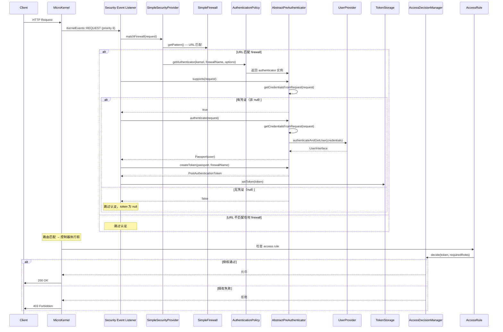
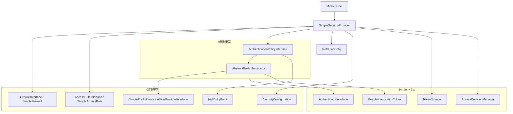

# Design Document

> PHP 8.5 Phase 3: Security Component Refactor — `.kiro/specs/php85-phase3-security-refactor/`

---

## Overview

本文档描述将项目自定义安全组件从 Symfony 4.x 的 `SimplePreAuthenticatorInterface` 三件套适配到 Symfony Security 7.x 统一 `AuthenticatorInterface` 的技术方案。

核心设计思路：

1. **新建 `AbstractPreAuthenticator`**（模板方法模式）：实现 `AuthenticatorInterface`，将 Symfony 7.x 的 6 个方法拆解为 `getCredentialsFromRequest()` + `authenticateAndGetUser()` 两步，子类只需实现这两个方法
2. **重新设计 `AuthenticationPolicyInterface`**：移除 `getAuthenticationProvider()` / `getAuthenticationListener()`，改为 `getAuthenticator()` + `getAuthenticatorConfig()`
3. **最小集成模式**（CR Q1=C）：不引入 `AuthenticatorManager`，在 kernel request event listener 中直接调用 authenticator 的 `supports()` → `authenticate()` → `createToken()`，使用 `BEFORE_PRIORITY_FIREWALL = 8`
4. **Token 策略**（CR Q2=C）：先用 `PostAuthenticationToken`，集成测试发现需要再扩展
5. **认证失败处理**（CR Q4=C）：不使用 Symfony lazy firewall 机制，自行在 event listener 中 catch 异常，认证失败不阻断请求

**不变量**：配置层组件（`FirewallInterface`、`AccessRuleInterface`、`SimpleFirewall`、`SimpleAccessRule`、`NullEntryPoint`、`SecurityConfiguration`）保持兼容，现有配置代码无需修改。

---

## Architecture

### 认证流程（重写后）



### 组件依赖关系



### Event Listener 优先级链

| Priority | Listener | 说明 |
|----------|----------|------|
| 512 | `BEFORE_PRIORITY_EARLIEST` | 最早 |
| 32 | `BEFORE_PRIORITY_ROUTING` | 路由解析 |
| 20 | `BEFORE_PRIORITY_CORS_PREFLIGHT` | CORS preflight |
| **8** | **`BEFORE_PRIORITY_FIREWALL`** | **Security firewall listener（本 Phase 实现）** |
| -512 | `BEFORE_PRIORITY_LATEST` | 最晚 |

Firewall listener 在路由解析和 CORS 之后执行，确保请求已有路由信息且 preflight 已处理。

---

## Components and Interfaces

### 1. AbstractPreAuthenticator（新建）

**文件**: `src/ServiceProviders/Security/AbstractPreAuthenticator.php`

**职责**: 实现 `AuthenticatorInterface`，用模板方法封装 Symfony 7.x 认证 API 的复杂性。

```php
namespace Oasis\Mlib\Http\ServiceProviders\Security;

use Symfony\Component\HttpFoundation\Request;
use Symfony\Component\HttpFoundation\Response;
use Symfony\Component\Security\Core\Authentication\Token\TokenInterface;
use Symfony\Component\Security\Core\Exception\AuthenticationException;
use Symfony\Component\Security\Http\Authenticator\AuthenticatorInterface;
use Symfony\Component\Security\Http\Authenticator\Passport\Badge\UserBadge;
use Symfony\Component\Security\Http\Authenticator\Passport\Passport;
use Symfony\Component\Security\Http\Authenticator\Passport\SelfValidatingPassport;
use Symfony\Component\Security\Core\Authentication\Token\PostAuthenticationToken;

abstract class AbstractPreAuthenticator implements AuthenticatorInterface
{
    /**
     * 从 Request 中提取凭证。返回 null 表示该 authenticator 不支持此请求。
     *
     * @return mixed|null 凭证数据，null 表示无凭证
     */
    abstract protected function getCredentialsFromRequest(Request $request): mixed;

    /**
     * 根据凭证查找并返回已认证的用户。
     *
     * @param mixed $credentials getCredentialsFromRequest() 返回的凭证
     * @throws AuthenticationException 认证失败时抛出
     */
    abstract protected function authenticateAndGetUser(mixed $credentials): \Symfony\Component\Security\Core\User\UserInterface;

    public function supports(Request $request): ?bool
    {
        return $this->getCredentialsFromRequest($request) !== null;
    }

    public function authenticate(Request $request): Passport
    {
        $credentials = $this->getCredentialsFromRequest($request);
        $user = $this->authenticateAndGetUser($credentials);

        return new SelfValidatingPassport(
            new UserBadge($user->getUserIdentifier(), fn() => $user)
        );
    }

    public function createToken(Passport $passport, string $firewallName): TokenInterface
    {
        $user = $passport->getUser();
        return new PostAuthenticationToken($user, $firewallName, $user->getRoles());
    }

    public function onAuthenticationSuccess(Request $request, TokenInterface $token, string $firewallName): ?Response
    {
        return null; // 不中断请求处理
    }

    public function onAuthenticationFailure(Request $request, AuthenticationException $exception): ?Response
    {
        return null; // 不阻断请求
    }
}
```

**设计决策**:
- 使用 `SelfValidatingPassport`：pre-auth 模式下凭证已在 `authenticateAndGetUser()` 中验证，无需额外 credential checker
- `getCredentialsFromRequest()` 声明为 `protected`：仅供模板方法内部调用，子类实现但不对外暴露
- `supports()` 调用 `getCredentialsFromRequest()` 判断：与 R1 AC2 一致，返回 null 表示不支持
- `onAuthenticationSuccess()` / `onAuthenticationFailure()` 均返回 null：保持现有行为（认证成功不产生额外响应，认证失败不阻断请求）

### 2. AuthenticationPolicyInterface（重新设计）

**文件**: `src/ServiceProviders/Security/AuthenticationPolicyInterface.php`

```php
namespace Oasis\Mlib\Http\ServiceProviders\Security;

use Oasis\Mlib\Http\MicroKernel;
use Symfony\Component\Security\Http\Authenticator\AuthenticatorInterface;
use Symfony\Component\Security\Http\EntryPoint\AuthenticationEntryPointInterface;

interface AuthenticationPolicyInterface
{
    const AUTH_TYPE_LOGOUT      = "logout";
    const AUTH_TYPE_PRE_AUTH    = "pre_auth";
    const AUTH_TYPE_FORM        = "form";
    const AUTH_TYPE_HTTP        = "http";
    const AUTH_TYPE_REMEMBER_ME = "remember_me";
    const AUTH_TYPE_ANONYMOUS   = "anonymous";

    /**
     * 返回认证类型标识。
     */
    public function getAuthenticationType(): string;

    /**
     * 创建并返回 authenticator 实例。
     * 替代旧的 getAuthenticationProvider() + getAuthenticationListener()。
     */
    public function getAuthenticator(MicroKernel $kernel, string $firewallName, array $options): AuthenticatorInterface;

    /**
     * 返回 authenticator 的配置选项。
     */
    public function getAuthenticatorConfig(): array;

    /**
     * 返回认证入口点。
     */
    public function getEntryPoint(MicroKernel $kernel, string $name, array $options): AuthenticationEntryPointInterface;
}
```

**变更点**:
- 移除 `getAuthenticationProvider()`（依赖已删除的 `AuthenticationProviderInterface`）
- 移除 `getAuthenticationListener()`（依赖已删除的 `ListenerInterface`）
- 新增 `getAuthenticator()`：返回 `AuthenticatorInterface`，一个方法替代原来两个
- 新增 `getAuthenticatorConfig()`：返回配置选项数组
- `getAuthenticationType()` 返回类型声明为 `string`
- `getAuthenticator()` 和 `getEntryPoint()` 参数类型声明为强类型

### 3. AbstractSimplePreAuthenticationPolicy（原地重写）

**文件**: `src/ServiceProviders/Security/AbstractSimplePreAuthenticationPolicy.php`

```php
namespace Oasis\Mlib\Http\ServiceProviders\Security;

use Oasis\Mlib\Http\MicroKernel;
use Symfony\Component\Security\Http\Authenticator\AuthenticatorInterface;
use Symfony\Component\Security\Http\EntryPoint\AuthenticationEntryPointInterface;

abstract class AbstractSimplePreAuthenticationPolicy implements AuthenticationPolicyInterface
{
    public function getAuthenticationType(): string
    {
        return self::AUTH_TYPE_PRE_AUTH;
    }

    abstract public function getAuthenticator(MicroKernel $kernel, string $firewallName, array $options): AuthenticatorInterface;

    public function getAuthenticatorConfig(): array
    {
        return [];
    }

    public function getEntryPoint(MicroKernel $kernel, string $name, array $options): AuthenticationEntryPointInterface
    {
        return new NullEntryPoint();
    }
}
```

**变更点**:
- 移除 `getAuthenticationProvider()` 和 `getAuthenticationListener()` 的 abstract 声明
- 新增 `getAuthenticator()` 为 abstract
- `getAuthenticatorConfig()` 默认返回空数组
- `getEntryPoint()` 保持返回 `NullEntryPoint`

### 4. SimpleSecurityProvider（重写 register 方法）

**文件**: `src/ServiceProviders/Security/SimpleSecurityProvider.php`

**核心变更**: `register()` 方法在配置解析后，增加 firewall listener 注册和 access decision manager 配置。

```php
public function register(MicroKernel $kernel, array $securityConfig = [])
{
    $this->kernel = $kernel;

    // 1. 合并 programmatic additions 和 config-based settings（现有逻辑不变）
    // ... 现有合并逻辑 ...

    $this->configDataProvider = $this->processConfiguration($securityConfig, new SecurityConfiguration());

    // 2. 创建 TokenStorage
    $tokenStorage = new TokenStorage();
    $kernel->setTokenStorage($tokenStorage);

    // 3. 配置 RoleHierarchy + AccessDecisionManager
    $roleHierarchy = new RoleHierarchy($this->getRoleHierarchy());
    $roleHierarchyVoter = new RoleHierarchyVoter($roleHierarchy);
    $accessDecisionManager = new AccessDecisionManager([$roleHierarchyVoter], new UnanimousStrategy());
    $authorizationChecker = new AuthorizationChecker($tokenStorage, $accessDecisionManager);
    $kernel->setAuthorizationChecker($authorizationChecker);

    // 4. 注册 firewall event listener
    $this->registerFirewallListener($kernel, $tokenStorage);

    // 5. 注册 access rule listener
    $this->registerAccessRuleListener($kernel, $tokenStorage, $accessDecisionManager);
}
```

**新增方法**:

```php
/**
 * 注册 firewall event listener 到 KernelEvents::REQUEST。
 * 使用 BEFORE_PRIORITY_FIREWALL = 8 优先级。
 */
protected function registerFirewallListener(MicroKernel $kernel, TokenStorageInterface $tokenStorage): void
{
    $firewalls = $this->getFirewalls();
    $policies = $this->getPolicies();

    $kernel->getContainer()->get('event_dispatcher')->addListener(
        KernelEvents::REQUEST,
        function (RequestEvent $event) use ($kernel, $firewalls, $policies, $tokenStorage) {
            if (!$event->isMainRequest()) {
                return;
            }
            $request = $event->getRequest();

            foreach ($firewalls as $firewallName => $firewallConfig) {
                $pattern = $firewallConfig['pattern'];
                if (!$this->requestMatchesPattern($request, $pattern)) {
                    continue;
                }

                // 找到匹配的 firewall，遍历其 policies
                foreach ($firewallConfig as $policyName => $policyOptions) {
                    if (!isset($policies[$policyName])) {
                        continue;
                    }
                    /** @var AuthenticationPolicyInterface $policy */
                    $policy = $policies[$policyName];
                    $options = is_array($policyOptions) ? $policyOptions : [];

                    $authenticator = $policy->getAuthenticator($kernel, $firewallName, $options);

                    try {
                        if (!$authenticator->supports($request)) {
                            continue;
                        }
                        $passport = $authenticator->authenticate($request);
                        $token = $authenticator->createToken($passport, $firewallName);
                        $tokenStorage->setToken($token);
                    } catch (AuthenticationException $e) {
                        // 认证失败：不阻断请求，token 保持 null
                        // 由 access rule listener 决定是否拒绝
                    }
                }
                break; // 第一个匹配的 firewall 生效
            }
        },
        MicroKernel::BEFORE_PRIORITY_FIREWALL
    );
}

/**
 * 注册 access rule listener。
 * 在 firewall listener 之后、controller 执行之前检查授权。
 */
protected function registerAccessRuleListener(
    MicroKernel $kernel,
    TokenStorageInterface $tokenStorage,
    AccessDecisionManagerInterface $accessDecisionManager
): void {
    $accessRules = $this->getAccessRules();

    $kernel->getContainer()->get('event_dispatcher')->addListener(
        KernelEvents::REQUEST,
        function (RequestEvent $event) use ($accessRules, $tokenStorage, $accessDecisionManager) {
            if (!$event->isMainRequest()) {
                return;
            }
            $request = $event->getRequest();
            $token = $tokenStorage->getToken();

            foreach ($accessRules as [$pattern, $roles, $channel]) {
                if (!$this->requestMatchesPattern($request, $pattern)) {
                    continue;
                }

                // 第一个匹配的 rule 生效
                if (empty($roles)) {
                    return; // 无角色要求，允许访问
                }

                if (!$token || !$token->getUser()) {
                    throw new AccessDeniedHttpException('Access Denied');
                }

                if (!$accessDecisionManager->decide($token, (array)$roles)) {
                    throw new AccessDeniedHttpException('Access Denied');
                }

                return; // 授权通过
            }
        },
        MicroKernel::BEFORE_PRIORITY_FIREWALL - 1 // 在 firewall 之后
    );
}

/**
 * 检查请求是否匹配 pattern。
 * pattern 可以是 string（正则）或 RequestMatcherInterface。
 */
protected function requestMatchesPattern(Request $request, mixed $pattern): bool
{
    if ($pattern instanceof RequestMatcherInterface) {
        return $pattern->matches($request);
    }
    return (bool)preg_match('{' . $pattern . '}', rawurldecode($request->getPathInfo()));
}
```

**设计决策**:
- **最小集成**（CR Q1=C）：不引入 `AuthenticatorManager`，直接在 closure listener 中调用 authenticator 方法
- **Firewall 匹配策略**：第一个匹配的 firewall 生效（与 Symfony 默认行为一致）
- **Access rule 匹配策略**：按注册顺序匹配，第一个匹配的 rule 生效（R10 AC3）
- **Access rule listener 优先级**：`BEFORE_PRIORITY_FIREWALL - 1 = 7`，在 firewall 认证之后执行
- **认证失败处理**（CR Q4=C）：catch `AuthenticationException`，不设 token，请求继续
- **RoleHierarchy**：使用 Symfony 的 `RoleHierarchy` + `RoleHierarchyVoter` + `AccessDecisionManager(voters, UnanimousStrategy)` 组合
- **Pattern 匹配**：支持 string（正则）和 `RequestMatcherInterface`（如 `ChainRequestMatcher`），与现有测试配置兼容

### 5. AbstractSimplePreAuthenticateUserProvider（保持）

**文件**: `src/ServiceProviders/Security/AbstractSimplePreAuthenticateUserProvider.php`

**变更**: 无。该类已实现 `SimplePreAuthenticateUserProviderInterface`，`authenticateAndGetUser()` 模式与新 authenticator 系统兼容。`AbstractPreAuthenticator` 的 `authenticateAndGetUser()` 方法直接委托给 user provider 的同名方法。

### 6. AbstractSimplePreAuthenticator（废弃标记）

**文件**: `src/ServiceProviders/Security/AbstractSimplePreAuthenticator.php`

**变更**: 添加 `@deprecated` 注解，指向 `AbstractPreAuthenticator` 作为替代。将 `createToken()`、`authenticateToken()`、`supportsToken()` 从 abstract 改为 concrete 方法，方法体抛出 `LogicException`（提示使用 `AbstractPreAuthenticator`）。保留 `getCredentialsFromRequest()` 为 abstract（子类仍需实现）。这样旧类可以被实例化（不再是 abstract class），但调用旧 API 方法时会得到明确错误。

### 7. 配置层组件（保持兼容）

以下组件不做修改：
- `FirewallInterface` / `SimpleFirewall`
- `AccessRuleInterface` / `SimpleAccessRule`
- `NullEntryPoint`
- `SecurityConfiguration`
- `SimpleFirewallConfiguration` / `SimpleAccessRuleConfiguration`
- `SimplePreAuthenticateUserProviderInterface`

### 8. 测试辅助类重写

| 文件 | 变更 |
|------|------|
| `TestApiUserPreAuthenticator` | 改为继承 `AbstractPreAuthenticator`，实现 `getCredentialsFromRequest()`（从 `sig` 参数提取）+ `authenticateAndGetUser()`（委托给 `TestApiUserProvider`） |
| `TestAuthenticationPolicy` | 改为实现新版 `AuthenticationPolicyInterface`，`getAuthenticator()` 返回 `TestApiUserPreAuthenticator` 实例 |
| `TestApiUserProvider` | 不变 |
| `TestApiUser` | 不变 |
| `TestAccessRule` | 不变 |

**TestApiUserPreAuthenticator 新设计**:

```php
class TestApiUserPreAuthenticator extends AbstractPreAuthenticator
{
    private SimplePreAuthenticateUserProviderInterface $userProvider;

    public function __construct(SimplePreAuthenticateUserProviderInterface $userProvider)
    {
        $this->userProvider = $userProvider;
    }

    protected function getCredentialsFromRequest(Request $request): mixed
    {
        $apiKey = $request->query->get('sig');
        return $apiKey ?: null; // null 表示不支持
    }

    protected function authenticateAndGetUser(mixed $credentials): UserInterface
    {
        return $this->userProvider->authenticateAndGetUser($credentials);
    }
}
```

**TestAuthenticationPolicy 新设计**:

```php
class TestAuthenticationPolicy extends AbstractSimplePreAuthenticationPolicy
{
    public function getAuthenticator(MicroKernel $kernel, string $firewallName, array $options): AuthenticatorInterface
    {
        $userProvider = /* 从 firewall config 获取 */;
        return new TestApiUserPreAuthenticator($userProvider);
    }
}
```

注意：`TestApiUserPreAuthenticator` 需要 `userProvider` 注入。`TestAuthenticationPolicy::getAuthenticator()` 从 firewall 配置中获取 user provider 并传入。具体获取方式：`SimpleSecurityProvider` 在调用 `getAuthenticator()` 时，将 firewall 的 `users` 配置作为 `$options` 的一部分传入，或 `TestAuthenticationPolicy` 在构造时持有 user provider 引用。

---

## Data Models

### Token 模型

使用 Symfony 内置的 `PostAuthenticationToken`（CR Q2=C）：

| 属性 | 类型 | 说明 |
|------|------|------|
| `user` | `UserInterface` | 已认证的用户 |
| `firewallName` | `string` | 防火墙名称 |
| `roles` | `string[]` | 用户角色列表 |

### Passport 模型

使用 Symfony 内置的 `SelfValidatingPassport`：

| 组成 | 类型 | 说明 |
|------|------|------|
| `userBadge` | `UserBadge` | 包含用户标识和用户加载器 |

### 配置数据模型（不变）

**SecurityConfiguration** 配置树：

```
security:
  policies:     # AuthenticationPolicyInterface[] — 认证策略
  firewalls:    # FirewallInterface[] | array[] — 防火墙配置
  access_rules: # AccessRuleInterface[] | array[] — 访问规则
  role_hierarchy: # array<string, string|string[]> — 角色继承
```

**SimpleFirewall** 配置：

| 字段 | 类型 | 必填 | 默认值 |
|------|------|------|--------|
| `pattern` | `string\|RequestMatcherInterface` | 是 | — |
| `policies` | `array` | 是 | — |
| `users` | `array\|UserProviderInterface` | 是 | — |
| `stateless` | `bool` | 否 | `false` |
| `misc` | `array` | 否 | `[]` |

**SimpleAccessRule** 配置：

| 字段 | 类型 | 必填 | 默认值 |
|------|------|------|--------|
| `pattern` | `string\|RequestMatcherInterface` | 是 | — |
| `roles` | `string\|string[]` | 是 | — |
| `channel` | `null\|'http'\|'https'` | 否 | `null` |


---

## Correctness Properties

*A property is a characteristic or behavior that should hold true across all valid executions of a system — essentially, a formal statement about what the system should do. Properties serve as the bridge between human-readable specifications and machine-verifiable correctness guarantees.*

### Property 1: Supports ↔ Credentials 一致性

*For any* Request 对象，`AbstractPreAuthenticator.supports(request)` 的返回值 SHALL 等于 `getCredentialsFromRequest(request) !== null`。即：有凭证时返回 true，无凭证时返回 false。

**Validates: Requirements 1.2, 14.1, 14.2**

### Property 2: Authenticate round-trip

*For any* 能映射到有效用户的凭证，调用 `authenticate(request)` 返回的 Passport 中的用户 SHALL 等于 `authenticateAndGetUser(credentials)` 返回的用户（同一对象）。

**Validates: Requirements 1.3, 14.3**

### Property 3: Authenticate error condition

*For any* 无法映射到有效用户的凭证，调用 `authenticate(request)` SHALL 抛出 `AuthenticationException`（或其子类）。

**Validates: Requirements 1.4, 14.4**

### Property 4: CreateToken invariant

*For any* 包含有效用户的 Passport 和任意 firewall 名称，`createToken(passport, firewallName)` 返回的 token SHALL 满足：`token.getUser() === passport.getUser()` 且 `token.getRoleNames()` 包含该用户的所有角色。

**Validates: Requirements 1.5, 14.5**

### Property 5: Access rule 配置 round-trip

*For any* 有效的 pattern 字符串、roles 数组和 channel 值（null / `http` / `https`），构造 `SimpleAccessRule` 后，`getPattern()` SHALL 返回原 pattern，`getRequiredRoles()` SHALL 返回原 roles（已归一化为数组），`getRequiredChannel()` SHALL 返回原 channel。

**Validates: Requirements 11.1, 11.2, 11.3**

### Property 6: Access rule invariant

*For any* 有效配置构造的 `SimpleAccessRule` 实例，`getPattern()` SHALL 返回非空值，`getRequiredRoles()` SHALL 返回数组类型（即使输入为 string，也应被归一化为数组）。

**Validates: Requirements 11.4, 11.5**

### Property 7: Firewall 配置 round-trip

*For any* 有效的 firewall 配置（包含 pattern、policies、users），构造 `SimpleFirewall` 后，`getPattern()` SHALL 返回原 pattern，`getPolicies()` SHALL 返回原 policies，`isStateless()` SHALL 返回原 stateless 标志。

**Validates: Requirements 12.1, 12.2, 12.3**

### Property 8: Firewall 解析输出 invariant

*For any* `SimpleFirewall` 实例，`SimpleSecurityProvider.parseFirewall()` 的输出 SHALL 包含 `pattern`、`users`、`stateless` 键。

**Validates: Requirements 12.4**

### Property 9: Firewall 缺失必填字段 error condition

*For any* 缺少 `pattern`、`policies` 或 `users` 中任一必填字段的配置数组，构造 `SimpleFirewall` SHALL 抛出配置校验异常。

**Validates: Requirements 12.5**

### Property 10: Role hierarchy merge idempotence

*For any* role hierarchy 配置，通过 `addRoleHierarchy()` 重复添加同一 parent → children 映射后，`getRoleHierarchy()` 的语义结果（每个 parent 对应的 children 集合）SHALL 不变（去重后等价）。

**Validates: Requirements 13.1**

### Property 11: Role hierarchy 继承链传递性

*For any* role hierarchy 配置中存在链式继承 A → B → C，当使用 Symfony `RoleHierarchy` 解析角色 A 时，解析结果 SHALL 包含 B 和 C。继承链越长，解析出的角色集合越大或相等。

**Validates: Requirements 13.2**

### Property 12: Role hierarchy single-level round-trip

*For any* 单层 role hierarchy（A → [B, C]），`getRoleHierarchy()` 的输出中 A 对应的 children SHALL 包含 B 和 C。

**Validates: Requirements 13.3**

### Property 13: Security 配置注册 invariant

*For any* 包含有效 policies、firewalls、access_rules 和 role_hierarchy 的安全配置，`SimpleSecurityProvider.register()` SHALL 成功完成而不抛出异常。

**Validates: Requirements 15.1**

### Property 14: 配置合并顺序 confluence

*For any* 同时包含 programmatic additions 和 config-based settings 的安全配置，`SimpleSecurityProvider` SHALL 将 programmatic additions 追加在 config-based settings 之后。合并顺序确定且可预测。

**Validates: Requirements 15.2**

### Property 15: Role hierarchy string 归一化 round-trip

*For any* `role_hierarchy` 配置中值为 string 的条目（如 `"ROLE_A"`），`SecurityConfiguration` SHALL 自动将其转换为单元素数组（`["ROLE_A"]`）。

**Validates: Requirements 15.3**

### Property 16: RefreshUser identity

*For any* `UserInterface` 实例，`AbstractSimplePreAuthenticateUserProvider.refreshUser(user)` SHALL 返回传入的同一用户对象。

**Validates: Requirements 2.4**

---

## Error Handling

### 认证阶段错误处理

| 错误场景 | 处理方式 | 对应 Requirement |
|----------|----------|-----------------|
| `getCredentialsFromRequest()` 返回 null | `supports()` 返回 false，跳过认证 | R1 AC2, R9 AC3 |
| `authenticateAndGetUser()` 抛出 `AuthenticationException` | Firewall listener catch 异常，不设 token，请求继续 | R1 AC4, R9 AC2 |
| `authenticateAndGetUser()` 抛出 `UserNotFoundException` | 同上（`UserNotFoundException` 是 `AuthenticationException` 子类） | R9 AC2 |

### 授权阶段错误处理

| 错误场景 | 处理方式 | 对应 Requirement |
|----------|----------|-----------------|
| Token 为 null 且 access rule 要求角色 | 抛出 `AccessDeniedHttpException`（403） | R9 AC5 |
| Token 存在但用户缺少所需角色 | 抛出 `AccessDeniedHttpException`（403） | R9 AC5 |
| 请求不匹配任何 access rule | 允许访问（无授权约束） | R10 AC2 |

### 配置阶段错误处理

| 错误场景 | 处理方式 | 对应 Requirement |
|----------|----------|-----------------|
| `SimpleFirewall` 缺少必填字段 | Symfony Config 组件抛出配置校验异常 | R12 AC5 |
| `SimpleAccessRule` 缺少必填字段 | 同上 | R6 AC4 |
| `getConfigDataProvider()` 在 `register()` 前调用 | 抛出 `LogicException` | R5 AC8 |
| `loadUserByIdentifier()` 被调用 | 抛出 `LogicException`（pre-auth 模式不使用） | R2 AC3 |

### 旧 API 调用错误处理

| 错误场景 | 处理方式 | 对应 Requirement |
|----------|----------|-----------------|
| 调用废弃的 `AbstractSimplePreAuthenticator.createToken()` | 改为 concrete 方法，抛出 `LogicException`（当前为 abstract，R7 实现时改为 concrete + `@deprecated`） | R7 AC2 |
| 调用废弃的 `AbstractSimplePreAuthenticator.authenticateToken()` | 同上 | R7 AC2 |
| 调用废弃的 `AbstractSimplePreAuthenticator.supportsToken()` | 同上 | R7 AC2 |

---

## Testing Strategy

### 测试分层

| 层次 | 目的 | 工具 | 对应 Requirements |
|------|------|------|------------------|
| **Unit tests** | 验证单个组件的具体行为和边界条件 | PHPUnit 13.x | R1–R8 |
| **Property tests** | 验证组件在随机输入下的通用属性 | Eris 1.x + PHPUnit | R11–R15 |
| **Integration tests** | 验证完整认证授权链路 | PHPUnit WebTestCase | R9–R10, R16 |

### Unit Tests

**新增/修改的单元测试文件**:

| 文件 | 被测组件 | 覆盖 AC |
|------|---------|---------|
| `ut/Security/AbstractPreAuthenticatorTest.php`（新增） | `AbstractPreAuthenticator` | R1 AC1–9 |
| `ut/Security/AuthenticationPolicyInterfaceTest.php`（新增） | `AuthenticationPolicyInterface` 反射验证 | R3 AC1–7 |
| `ut/Security/AbstractSimplePreAuthenticationPolicyTest.php`（新增） | `AbstractSimplePreAuthenticationPolicy` | R4 AC1–5 |
| `ut/Security/SimpleSecurityProviderTest.php`（新增） | `SimpleSecurityProvider` register 逻辑 | R5 AC3–8 |
| `ut/Security/SecurityServiceProviderTest.php`（修改） | 适配新 API | R16 AC1 |
| `ut/Security/SecurityServiceProviderConfigurationTest.php`（修改） | 适配新 API | R16 AC2 |
| `ut/Security/NullEntryPointTest.php`（不变） | `NullEntryPoint` | R16 AC3 |

### Property-Based Tests

**PBT 库**: Eris 1.x（`giorgiosironi/eris`，已在 `composer.json` 的 `require-dev` 中声明）

**配置**: 每个 property test 最少 100 次迭代（Eris 默认）

**新增 PBT 文件**:

| 文件 | 覆盖 Property | 覆盖 Requirements |
|------|--------------|------------------|
| `ut/PBT/AccessRulePropertyTest.php` | P5, P6 | R11 |
| `ut/PBT/FirewallPropertyTest.php` | P7, P8, P9 | R12 |
| `ut/PBT/RoleHierarchyPropertyTest.php` | P10, P11, P12 | R13 |
| `ut/PBT/AuthenticatorPropertyTest.php` | P1, P2, P3, P4 | R1, R14 |
| `ut/PBT/SecurityConfigPropertyTest.php` | P13, P14, P15, P16 | R2, R15 |

**Tag 格式**: 每个 PBT 方法的 docblock 中标注：

```php
/**
 * Feature: php85-phase3-security-refactor, Property 5: Access rule 配置 round-trip
 * For any valid pattern, roles, and channel, SimpleAccessRule round-trip preserves values.
 *
 * Ref: Requirements 11.1, 11.2, 11.3
 */
```

**PBT 注册**: 所有 PBT 文件放在 `ut/PBT/` 目录，已被 `phpunit.xml` 的 `pbt` suite 自动包含（`<directory>ut/PBT</directory>`）。

### Integration Tests

| 文件 | 覆盖 AC |
|------|---------|
| `ut/Integration/SecurityAuthenticationFlowIntegrationTest.php`（修改） | R9 AC1–5, R10 AC1–5 |
| `ut/Security/SecurityServiceProviderTest.php`（修改） | R16 AC1 |
| `ut/Security/SecurityServiceProviderConfigurationTest.php`（修改） | R16 AC2 |

### 测试互补关系

- **Unit tests** 验证具体行为（如 `onAuthenticationSuccess()` 返回 null、`loadUserByIdentifier()` 抛异常）
- **Property tests** 验证通用属性（如 round-trip、invariant、error condition），覆盖 unit test 难以穷举的输入空间
- **Integration tests** 验证端到端链路（如完整的 request → firewall → authenticator → access rule → response 流程）

### phpunit.xml 变更

`pbt` suite 已存在（`<directory>ut/PBT</directory>`），新增的 PBT 文件自动包含。`security` 和 `integration` suite 中的现有文件保持不变，测试内容适配新 API。

如需单独运行 security PBT：

```bash
phpunit --testsuite pbt --filter Security
```

---

## Impact Analysis

### 受影响的文件

| 文件 | 变更类型 | 说明 |
|------|---------|------|
| `src/ServiceProviders/Security/AbstractPreAuthenticator.php` | **新增** | 新 authenticator 抽象类 |
| `src/ServiceProviders/Security/AuthenticationPolicyInterface.php` | **重写** | 移除旧方法，新增 `getAuthenticator()` / `getAuthenticatorConfig()` |
| `src/ServiceProviders/Security/AbstractSimplePreAuthenticationPolicy.php` | **重写** | 适配新接口 |
| `src/ServiceProviders/Security/SimpleSecurityProvider.php` | **重写** | `register()` 增加 firewall listener 和 access rule listener 注册 |
| `src/ServiceProviders/Security/AbstractSimplePreAuthenticator.php` | **修改** | 添加 `@deprecated` 注解 |
| `src/ServiceProviders/Security/AbstractSimplePreAuthenticateUserProvider.php` | **不变** | — |
| `src/ServiceProviders/Security/SimplePreAuthenticateUserProviderInterface.php` | **不变** | — |
| `src/ServiceProviders/Security/FirewallInterface.php` | **不变** | — |
| `src/ServiceProviders/Security/SimpleFirewall.php` | **不变** | — |
| `src/ServiceProviders/Security/AccessRuleInterface.php` | **不变** | — |
| `src/ServiceProviders/Security/SimpleAccessRule.php` | **不变** | — |
| `src/ServiceProviders/Security/NullEntryPoint.php` | **不变** | — |
| `src/Configuration/SecurityConfiguration.php` | **不变** | — |
| `src/Configuration/SimpleFirewallConfiguration.php` | **不变** | — |
| `src/Configuration/SimpleAccessRuleConfiguration.php` | **不变** | — |
| `src/MicroKernel.php` | **不变** | `registerSecurity()` 已调用 `SimpleSecurityProvider.register()`，无需修改 |
| `ut/Helpers/Security/TestApiUserPreAuthenticator.php` | **重写** | 继承 `AbstractPreAuthenticator` |
| `ut/Helpers/Security/TestAuthenticationPolicy.php` | **重写** | 实现新版 `AuthenticationPolicyInterface` |
| `ut/Helpers/Security/TestApiUserProvider.php` | **不变** | — |
| `ut/Helpers/Security/TestApiUser.php` | **不变** | — |
| `ut/Helpers/Security/TestAccessRule.php` | **不变** | — |
| `ut/Security/SecurityServiceProviderTest.php` | **修改** | 适配新 API |
| `ut/Security/SecurityServiceProviderConfigurationTest.php` | **修改** | 适配新 API |
| `ut/Integration/SecurityAuthenticationFlowIntegrationTest.php` | **修改** | 适配新 API |
| `ut/Integration/app.integration-security.php` | **修改** | 适配新 API |
| `ut/Security/app.security.php` | **修改** | 适配新 API |
| `ut/Security/app.security2.php` | **修改** | 适配新 API |
| `ut/PBT/AccessRulePropertyTest.php` | **新增** | PBT |
| `ut/PBT/FirewallPropertyTest.php` | **新增** | PBT |
| `ut/PBT/RoleHierarchyPropertyTest.php` | **新增** | PBT |
| `ut/PBT/AuthenticatorPropertyTest.php` | **新增** | PBT |
| `ut/PBT/SecurityConfigPropertyTest.php` | **新增** | PBT |

### State 文档影响

- `docs/state/architecture.md`：
  - `## 安全模型` section 需更新，反映新的 authenticator 系统（`AuthenticatorInterface` 替代三件套），补充 firewall event listener 和 access rule listener 的注册机制
  - `## 请求处理流程` 第 3 步 "Firewall（priority 8）" 的描述需补充 authenticator 调用链路（`supports()` → `authenticate()` → `createToken()` → token storage）

### 现有 model / service / CLI 行为变化

- `AuthenticationPolicyInterface` 是 breaking change：移除了 `getAuthenticationProvider()` 和 `getAuthenticationListener()`，新增 `getAuthenticator()` 和 `getAuthenticatorConfig()`。所有实现类必须适配。
- `SimpleSecurityProvider.register()` 从"仅解析配置"变为"解析配置 + 注册 listener + 配置授权"，行为显著增强。

### 数据模型变更

- 无。配置数据模型（SecurityConfiguration、SimpleFirewallConfiguration、SimpleAccessRuleConfiguration）保持不变。

### 外部系统交互变化

- 无。

### 配置项变更

- 无。Bootstrap config 的 `security` 配置树结构不变。

### 风险点

- `AuthenticationPolicyInterface` 的 breaking change 可能影响下游项目中直接实现该接口的类。通过 `AbstractSimplePreAuthenticationPolicy` 间接实现的类只需适配 `getAuthenticator()` 方法。
- `SimpleSecurityProvider.register()` 的行为增强引入了 event listener 注册，需通过 `$kernel->getContainer()->get('event_dispatcher')` 获取 event dispatcher。由于 `registerSecurity()` 在 `boot()` 中 `parent::boot()` 之后调用，DI container 已初始化，此路径安全。
- Firewall listener 和 access rule listener 使用 closure 注册，调试时 stack trace 可读性较差。

---

## Alternatives Considered

### Authenticator 系统集成深度

| 方案 | 描述 | 落选理由 |
|------|------|---------|
| A) 完整链路 | `AuthenticatorManager` + `FirewallMap` + 自定义 event listener | 代码量大，引入不必要的 Symfony 内部组件依赖 |
| B) 部分集成 | `AuthenticatorManager` + Symfony `FirewallEventListener` | 仍需理解 Symfony 内部 firewall 机制，与自管理模式冲突 |
| **C) 最小集成**（采用） | 直接在 event listener 中调用 authenticator 方法 | 最小依赖，与 Q3=A 自管理模式一致 |

### Token 类型

| 方案 | 描述 | 落选理由 |
|------|------|---------|
| A) 直接用 `PostAuthenticationToken` | Symfony 内置，无需自定义 | — |
| B) 自定义 token 类 | 携带原始凭证信息 | 过度设计，当前无需求 |
| **C) 先用 `PostAuthenticationToken`**（采用） | 集成测试发现需要再扩展 | 渐进式，避免过早抽象 |

### 认证失败处理

| 方案 | 描述 | 落选理由 |
|------|------|---------|
| A) Lazy firewall | 依赖 Symfony lazy firewall 机制 | 需要 `AuthenticatorManager`，与 Q1=C 冲突 |
| B) 非 lazy firewall | `onAuthenticationFailure()` 返回错误响应 | 改变现有行为（认证失败不阻断请求） |
| **C) 自行控制**（采用） | Event listener 中 catch 异常，不设 token | 与现有行为一致，最简单 |

### Access Rule Listener 实现方式

| 方案 | 描述 | 落选理由 |
|------|------|---------|
| A) 复用 Symfony `AccessListener` | 使用 Symfony 内置的 access listener | 需要 `FirewallMap` 和 `SecurityBundle` 配置，与自管理模式冲突 |
| **B) 自定义 listener**（采用） | 在 event listener 中遍历 access rules，使用 `AccessDecisionManager` 判断 | 与自管理模式一致，逻辑简单透明 |

---

## Socratic Review

**Q: Design 是否完整覆盖了 requirements 中的每条需求？**
A: R1（AbstractPreAuthenticator）→ Components §1；R2（UserProvider）→ Components §5；R3（AuthenticationPolicyInterface）→ Components §2；R4（AbstractSimplePreAuthenticationPolicy）→ Components §3；R5（SimpleSecurityProvider）→ Components §4；R6（配置层兼容）→ Components §7；R7（旧类废弃）→ Components §6；R8（测试辅助类）→ Components §8；R9–R10（行为不变）→ Architecture 流程图 + Error Handling；R11–R15（PBT）→ Correctness Properties + Testing Strategy；R16–R17（测试适配和通过）→ Testing Strategy。全部覆盖。

**Q: CR 决策是否已体现在 design 中？**
A: Q1=C（最小集成）→ Components §4 的 `registerFirewallListener()` 直接调用 authenticator 方法；Q2=C（先用 PostAuthenticationToken）→ Components §1 的 `createToken()` 和 Data Models；Q3=B（自定义优先级 BEFORE_PRIORITY_FIREWALL=8）→ Architecture 优先级表和 Components §4；Q4=C（自行控制认证失败）→ Components §4 的 catch 逻辑和 Error Handling。四个 CR 决策均已体现。

**Q: `SelfValidatingPassport` 是否是正确的 Passport 类型？**
A: 是。Pre-auth 模式下，凭证验证在 `authenticateAndGetUser()` 中完成（user provider 负责验证凭证并返回用户或抛异常）。不需要额外的 credential checker（如 `PasswordCredentials`），因此 `SelfValidatingPassport` 是正确选择。

**Q: Access rule listener 的优先级 7 是否会与其他 listener 冲突？**
A: 当前 MicroKernel 定义的优先级常量中，`BEFORE_PRIORITY_FIREWALL = 8` 是最接近的。优先级 7 在 firewall（8）之后、用户 middleware 之前，位置正确。如果未来有其他 listener 使用优先级 7，需要调整。但当前代码中没有冲突。

**Q: `requestMatchesPattern()` 的正则匹配是否与 Symfony 的行为一致？**
A: 使用 `preg_match('{' . $pattern . '}', rawurldecode($request->getPathInfo()))` 与 Symfony 的 `RequestMatcher` 行为一致（Symfony 内部也使用类似的正则匹配）。同时支持 `RequestMatcherInterface` 对象（如 `ChainRequestMatcher`），与现有测试配置兼容。

**Q: `SimpleSecurityProvider.register()` 中 event dispatcher 是否已初始化？**
A: `registerSecurity()` 在 `MicroKernel.boot()` 流程中调用。`boot()` 调用 `parent::boot()`（Symfony Kernel）后才调用 `registerSecurity()`，此时 DI container 已初始化，event dispatcher 可通过 `$kernel->getContainer()->get('event_dispatcher')` 获取。这与 MicroKernel 中其他 register 方法（`registerMiddlewares()`、`registerErrorHandlers()` 等）使用的模式一致。

**Q: 为什么 Property 10（idempotence）测试 `addRoleHierarchy` 而不是 `getRoleHierarchy`？**
A: `addRoleHierarchy()` 使用 `array_merge` 追加 children，重复调用会产生重复元素。Property 10 验证的是语义等价性（去重后 children 集合相同），而非数组严格相等。这确保了即使有重复添加，最终行为不变。

**Q: 是否存在未经确认的重大技术选型？**
A: 所有关键技术决策均已通过 requirements CR 和 goal.md Clarification 确认。Design 中的实现细节（如 `SelfValidatingPassport`、access rule listener 优先级 7、`requestMatchesPattern()` 实现）是基于已确认决策的自然推导，不涉及新的重大选型。


---

## Gatekeep Log

**校验时间**: 2025-07-15
**校验结果**: ⚠️ 已修正后通过

### 修正项

- [内容] `SimpleSecurityProvider.register()` 中 `AccessDecisionManager` 构造方式错误：原文写 `new UnanimousStrategy([$roleHierarchyVoter])`，但 `UnanimousStrategy` 构造函数接受 `bool $allowIfAllAbstainDecisions`，不接受 voters。修正为 `new AccessDecisionManager([$roleHierarchyVoter], new UnanimousStrategy())`
- [内容] `registerFirewallListener()` 和 `registerAccessRuleListener()` 中使用了不存在的 `$kernel->getEventDispatcher()` 方法。MicroKernel 没有此方法，其他 register 方法（`registerMiddlewares()` 等）使用 `$this->getContainer()->get('event_dispatcher')`。修正为 `$kernel->getContainer()->get('event_dispatcher')`
- [内容] 风险点中关于 `MicroKernel.getEventDispatcher()` 可能未初始化的描述已修正，改为说明通过 DI container 获取 event dispatcher 的安全性
- [内容] Components §6（AbstractSimplePreAuthenticator 废弃标记）描述与 R7 AC2 不一致：当前源代码中 `createToken()`、`authenticateToken()`、`supportsToken()` 是 abstract 方法，无法直接"抛出 LogicException"。修正为明确说明需将这些方法从 abstract 改为 concrete + LogicException
- [内容] Error Handling 表中旧 API 调用错误处理的描述已修正，补充了从 abstract 改为 concrete 的实现说明
- [内容] State 文档影响描述过于笼统，修正为具体指出 `## 安全模型` 和 `## 请求处理流程` 两个 section 的更新内容
- [内容] Socratic Review 中关于 event dispatcher 初始化的回答已修正，移除了对不存在方法的引用

### 合规检查

**机械扫描**
- [x] 无 TBD / TODO / 待定 / 占位符
- [x] 无空 section 或不完整的列表
- [x] 内部引用一致（requirements 编号、术语引用）
- [x] 代码块语法正确（语言标注、闭合）
- [x] 无 markdown 格式错误

**结构校验**
- [x] 一级标题 `# Design Document` 存在
- [x] 技术方案主体存在（Overview + Architecture + Components and Interfaces），承接 requirements
- [x] 接口签名 / 数据模型有明确定义（完整 PHP 代码块 + 数据模型表格）
- [x] `## Impact Analysis` 存在
- [x] `## Alternatives Considered` 存在，含 4 个方案比选
- [x] `## Socratic Review` 存在，覆盖 7 个问题
- [x] 各 section 之间使用 `---` 分隔

**Requirements 覆盖校验**
- [x] R1（AbstractPreAuthenticator）→ Components §1
- [x] R2（UserProvider）→ Components §5
- [x] R3（AuthenticationPolicyInterface）→ Components §2
- [x] R4（AbstractSimplePreAuthenticationPolicy）→ Components §3
- [x] R5（SimpleSecurityProvider）→ Components §4
- [x] R6（配置层兼容）→ Components §7
- [x] R7（旧类废弃）→ Components §6（修正后）
- [x] R8（测试辅助类）→ Components §8
- [x] R9–R10（行为不变）→ Architecture 流程图 + Error Handling
- [x] R11–R15（PBT）→ Correctness Properties + Testing Strategy
- [x] R16–R17（测试适配和通过）→ Testing Strategy
- [x] 无遗漏的 requirement
- [x] design 中的方案不超出 requirements 的范围

**Impact Analysis 校验**
- [x] 受影响的 state 文档条目（修正后具体到 section）
- [○] graphify 查询结果：graphify 可用但节点名称与源代码类名不完全匹配（如 `SimpleSecurityProvider` 无法直接查询），通过 community 结构（Firewall & Access Rules、Pre-Authenticator、Auth Policy Interface 等）辅助确认了组件边界
- [x] 现有 model / service / CLI 行为变化
- [x] 数据模型变更（无）
- [x] 外部系统交互变化（无）
- [x] 配置项变更（无）

**技术方案质量校验**
- [x] 技术选型有明确理由（Alternatives Considered 覆盖 4 个决策点）
- [x] 接口签名足够清晰（完整 PHP 代码块含参数类型、返回类型、异常类型）
- [x] 模块间依赖关系清晰（组件依赖关系 mermaid 图）
- [x] 无过度设计
- [x] 与 state 文档中描述的现有架构一致（安全模型、请求处理流程、优先级链）

**目的性审查**
- [x] Requirements CR 回应：requirements.md Gatekeep Log 中 4 个 CR 决策（Q1=C 最小集成、Q2=C PostAuthenticationToken、Q3=B 自定义优先级、Q4=C 自行控制认证失败）均已在 design 中体现
- [x] 技术选型明确：无待定或含糊的选型
- [x] 接口定义可执行：所有接口含完整 PHP 代码块
- [x] Requirements 全覆盖：R1–R17 均有对应技术方案
- [x] Impact 充分评估
- [x] 可 task 化：组件边界清晰，依赖关系明确，可按组件拆分 task

### Clarification Round

**状态**: ✅ 已确认

**Q1:** `SimpleSecurityProvider.register()` 的重写涉及大量新增逻辑（TokenStorage 创建、RoleHierarchy 配置、firewall listener 注册、access rule listener 注册）。在拆分 task 时，是倾向于将 `register()` 重写作为一个整体 task（包含所有新增逻辑），还是拆分为多个子 task（如：配置解析 + TokenStorage → firewall listener → access rule listener → AuthorizationChecker）？

**A:** C — 按依赖层次拆分：先完成所有接口和抽象类（R1–R4, R7），再做 `register()` 集成（R5），最后做测试适配（R8, R16）

**Q2:** Design 中 `registerFirewallListener()` 和 `registerAccessRuleListener()` 作为 `SimpleSecurityProvider` 的 protected 方法实现。在 task 执行时，是否需要为这两个方法编写独立的单元测试（通过测试子类暴露 protected 方法），还是仅通过 `register()` 的集成测试覆盖？

**A:** C — 混合：firewall listener 通过集成测试覆盖（需要完整请求链路），access rule listener 通过单元测试覆盖（逻辑相对独立）

**Q3:** Design 中 `AbstractSimplePreAuthenticator` 的废弃处理（R7）需要将 `createToken()`、`authenticateToken()`、`supportsToken()` 从 abstract 改为 concrete + LogicException。这会使该类从 abstract class 变为可实例化的 concrete class（仅 `getCredentialsFromRequest()` 保持 abstract）。是否保持 `abstract class` 声明（因为 `getCredentialsFromRequest()` 仍为 abstract），还是改为 concrete class？

**A:** A — 保持 `abstract class`：`getCredentialsFromRequest()` 仍为 abstract，类不可直接实例化，语义上更准确

**Q4:** Design 中 access rule listener 使用优先级 `BEFORE_PRIORITY_FIREWALL - 1 = 7`，这个值没有对应的 MicroKernel 常量。在实现时，是直接使用硬编码的 `7`，还是在 MicroKernel 中新增一个常量（如 `BEFORE_PRIORITY_ACCESS_RULE = 7`）？

**A:** A — 硬编码 `MicroKernel::BEFORE_PRIORITY_FIREWALL - 1`：表达式清晰，无需新增常量
