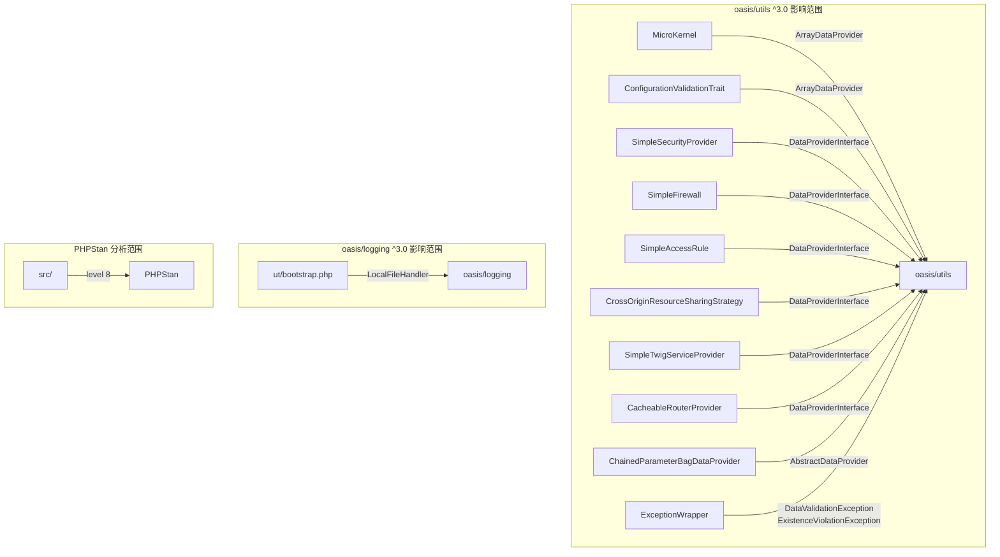

# Design Document

> PHP 8.5 Phase 5: Validation & Stabilization — `.kiro/specs/php85-phase5-validation-stabilization/`

---

## Overview

本 design 覆盖 Phase 5 的四大工作块：

1. **内部依赖 ^3.0 升级**（R1、R2）：将 `oasis/utils` 和 `oasis/logging` 从 `^2.0` 升级到 `^3.0`，逐一适配 API 变更
2. **PHPStan 引入与错误修复**（R3、R4）：引入 PHPStan level 8 静态分析，修复所有错误，false positive 通过 baseline 集中管理
3. **全量验证**（R5、R6、R7）：`phpunit` 全量通过 + PHPStan 零错误 + 零 deprecation notice，作为 branch 级 DoD 最终验证点
4. **文档全面 review 与更新**（R8、R9、R10、R11）：PROJECT.md、README.md、docs/state/、docs/manual/ 全面更新，反映 Phase 0–5 完成后的系统现状
5. **PBT 验证**（R12）：通过 Property-Based Testing 验证 `oasis/utils` ^3.0 升级后 ArrayDataProvider 核心 API 行为正确
6. **公共 API 兼容性验证**（R13）：从库使用者角度验证 2.5 版本的公共 API（routing、controller、view、security、CORS、bootstrap config、error handling）在 3.x 下行为一致

### 执行顺序

根据 GK-CR Q2=B（代码变更和文档更新交叉进行），整体执行顺序为：

```
R1 (oasis/utils ^3.0) → R2 (oasis/logging ^3.0) → R3 (PHPStan 引入)
→ R4 (PHPStan 修复) → R12 (PBT) → R8/R9/R10/R11 (文档更新，穿插进行)
→ R13 (公共 API 兼容性验证) → R5/R6/R7 (最终验证)
```

文档更新（R8–R11）在代码变更过程中交叉进行：每完成一个代码变更阶段，就更新相关文档。最终验证（R5–R7）在所有变更完成后统一执行。

### 设计决策摘要

| 决策 | 选择 | 来源 |
|------|------|------|
| oasis/utils ^3.0 升级策略 | 直接升级 + 逐一修复调用点 | GK-CR Q3=A |
| oasis/logging ^3.0 升级策略 | 直接升级 + 按需适配 | goal Q2=A |
| PHPStan 级别 | level 8，问题量过大可降到 level 5 | goal Q3=B |
| PHPStan 分析范围 | 仅 `src/`，不含 `ut/` | GK-CR Q4=A |
| false positive 抑制策略 | 优先 baseline 集中管理 | GK-CR Q1=A |
| 文档更新时机 | 与代码变更交叉进行 | GK-CR Q2=B |
| API 变更适配策略 | 逐一修改调用点，不引入 adapter | GK-CR Q3=A |
| PBT 框架 | Eris 1.x（已在 require-dev） | C-3 |

---

## Architecture

Phase 5 不引入新的架构组件，所有变更在现有架构内进行。以下是受影响的架构层次：

### 受影响的模块



### oasis/utils 使用点清单

| 类/文件 | 使用的 oasis/utils API | 位置 |
|---------|----------------------|------|
| `ConfigurationValidationTrait` | `ArrayDataProvider` 构造 | `src/Configuration/` |
| `MicroKernel` | `ArrayDataProvider`, `DataProviderInterface` 常量, `getMandatory()`, `getOptional()` | `src/MicroKernel.php` |
| `ChainedParameterBagDataProvider` | 继承 `AbstractDataProvider` | `src/ChainedParameterBagDataProvider.php` |
| `SimpleSecurityProvider` | `DataProviderInterface` 常量, `getOptional()` | `src/ServiceProviders/Security/` |
| `SimpleFirewall` | `DataProviderInterface` 常量, `getMandatory()` | `src/ServiceProviders/Security/` |
| `SimpleAccessRule` | `DataProviderInterface` 常量, `getMandatory()`, `getOptional()` | `src/ServiceProviders/Security/` |
| `CrossOriginResourceSharingStrategy` | `DataProviderInterface` 常量, `getMandatory()`, `getOptional()` | `src/ServiceProviders/Cors/` |
| `SimpleTwigServiceProvider` | `DataProviderInterface` 常量, `getMandatory()`, `getOptional()` | `src/ServiceProviders/Twig/` |
| `CacheableRouterProvider` | `DataProviderInterface` 常量, `getMandatory()`, `getOptional()` | `src/ServiceProviders/Routing/` |
| `ExceptionWrapper` | `DataValidationException`, `ExistenceViolationException` | `src/ErrorHandlers/` |
| `SilexKernelWebTest` | `StringUtils::stringStartsWith()` | `ut/SilexKernelWebTest.php` |
| `ExceptionWrapperTest` | `DataValidationException`, `ExistenceViolationException` | `ut/ErrorHandlers/` |
| `TestController` | `DataProviderInterface` 常量, `getMandatory()`, `getOptional()` | `ut/Helpers/Controllers/` |
| `ChainedParameterBagDataProviderTest` | `getOptional()` | `ut/Misc/` |

### oasis/logging 使用点清单

| 类/文件 | 使用的 oasis/logging API | 位置 |
|---------|------------------------|------|
| `ut/bootstrap.php` | `LocalFileHandler` 构造 + `install()` | `ut/bootstrap.php` |
| `MicroKernel` | 注释引用（不影响代码） | `src/MicroKernel.php` |

---

## Components and Interfaces

### 1. oasis/utils ^3.0 升级组件（R1）

**升级流程**：

1. 执行 `composer require oasis/utils:^3.0`
2. 检查编译错误和测试失败
3. 逐一修复所有调用点（GK-CR Q3=A：不引入 adapter）

**核心 API 使用模式**：

项目中使用的 `oasis/utils` API 主要分为三类：

- **数据容器 API**：`ArrayDataProvider::getMandatory()`, `getOptional()`, `has()`, `get()` — 广泛用于配置传递
- **类型常量**：`DataProviderInterface::MIXED_TYPE`, `ARRAY_TYPE`, `STRING_TYPE`, `INT_TYPE`, `BOOL_TYPE`, `FLOAT_TYPE` — 用于类型约束参数
- **异常类**：`DataValidationException`, `ExistenceViolationException` — 用于 ExceptionWrapper 的异常类型判断
- **继承关系**：`ChainedParameterBagDataProvider extends AbstractDataProvider` — 需要确认抽象方法签名兼容性
- **工具类**：`StringUtils::stringStartsWith()` — 仅在测试中使用

**适配策略**：

对于每个 API 变更，按以下优先级处理：
1. 如果方法签名变更（参数类型、返回类型），直接修改调用点
2. 如果方法重命名，全局替换
3. 如果方法移除，使用 ^3.0 提供的替代 API
4. 如果类型常量变更，全局替换常量引用

### 2. oasis/logging ^3.0 升级组件（R2）

**升级流程**：

1. 执行 `composer require oasis/logging:^3.0`
2. 检查 `ut/bootstrap.php` 中 `LocalFileHandler` 的兼容性
3. 如有 API 变更，适配 `(new LocalFileHandler('/tmp'))->install()` 调用

影响范围极小，仅 `ut/bootstrap.php` 一处。

### 3. PHPStan 配置组件（R3）

**配置文件**：项目根目录 `phpstan.neon`

```neon
parameters:
    level: 8
    paths:
        - src/
```

**Baseline 管理**（R4，GK-CR Q1=A）：

如果存在无法合理修复的 false positive，生成 baseline 文件：

```bash
vendor/bin/phpstan analyse --generate-baseline
```

生成的 `phpstan-baseline.neon` 在 `phpstan.neon` 中引用：

```neon
includes:
    - phpstan-baseline.neon

parameters:
    level: 8
    paths:
        - src/
```

仅在 baseline 无法覆盖的场景（如泛型类型推断问题）使用 inline `@phpstan-ignore` annotation，并附带 justification comment。

### 4. PHPStan 错误修复组件（R4）

**修复策略**：

1. 运行 `vendor/bin/phpstan analyse` 获取错误列表
2. 按错误类型分类处理：
   - **类型声明缺失**：添加 `@param`、`@return`、`@var` PHPDoc 或原生类型声明
   - **类型不匹配**：修正类型声明或添加类型断言
   - **未定义方法/属性**：修正拼写或添加 `@method` / `@property` PHPDoc
   - **不可达代码**：移除或修正逻辑
3. 每次修复后运行测试确认无行为变更（R4 AC2）
4. 无法合理修复的 false positive 加入 baseline（R4 AC3）

### 5. 文档更新组件（R8–R11）

**PROJECT.md 更新**（R8）：

需要更新的内容：
- 项目描述：Silex → Symfony MicroKernel
- 技术栈表格：PHP ≥ 8.5, Symfony 7.x, Twig 3.x, Guzzle 7.x, PHPUnit 13.x, oasis/utils ^3.0, oasis/logging ^3.0
- 核心入口：`SilexKernel` → `MicroKernel`
- 构建与测试命令：添加 PHPStan 命令
- 测试 Suite 表格：反映 `phpunit.xml` 中所有 suite（all, exceptions, cors, security, twig, aws, error-handlers, configuration, views, routing, cookie, middlewares, misc, integration, SilexKernelTest, SilexKernelWebTest, FallbackViewHandlerTest, pbt）

**README.md 更新**（R9）：

- PHP 版本要求：`>=8.5`
- 框架描述：Symfony MicroKernel
- 移除 Silex 相关引用

**docs/state/ 更新**（R10）：

- `architecture.md`：确认模块结构、类层次、公共 API 签名与代码一致
- 移除任何 Silex / Pimple / Symfony 4.x 引用
- 技术栈描述与 `composer.json` 一致

**docs/manual/ 更新**（R11）：

逐文件 review：
- `getting-started.md`：PHP 版本要求、安装步骤
- `bootstrap-configuration.md`：MicroKernel 配置结构
- `routing.md`：路由配置
- `security.md`：安全配置
- `cors.md`：CORS 配置
- `README.md`：目录索引

确保所有代码示例、配置说明与当前 MicroKernel + Symfony 7.x 一致。

### 6. PBT 验证组件（R12）

**测试文件**：`ut/PBT/ArrayDataProviderPropertyTest.php`

使用 Eris 1.x 生成随机配置数组，验证 ArrayDataProvider 的三个核心属性（详见 Correctness Properties 节）。

### 7. 公共 API 兼容性验证组件（R13）

**验证方式**：手工测试（manual test），按模块逐一验证 2.5 公共 API 在 3.x 下的行为一致性。

**验证维度**：

| 维度 | 验证内容 | 关键检查点 |
|------|---------|-----------|
| Routing | 2.5 的路由注册方式（route config 数组）在 3.x MicroKernel 下正常工作 | 路由解析、参数提取、HTTP method 匹配 |
| Controller | 2.5 的 controller 写法（参数注入、返回值类型）在 3.x 下兼容 | Request 注入、路由参数注入、Response 返回 |
| View/Renderer | 2.5 的 view handler（JSON、HTML、Twig 渲染）行为一致 | Content-Type、响应体格式、模板变量传递 |
| Security | 2.5 的 security 配置（firewall、access rule、authenticator）正常工作 | 认证流程、拦截行为、角色检查 |
| CORS | 2.5 的 CORS 配置行为一致 | preflight 响应、allowed origins/methods/headers |
| Bootstrap Config | 2.5 的 bootstrap config 数组在 3.x MicroKernel 下正常初始化 | 配置 key 兼容性、默认值行为 |
| Error Handling | 2.5 的异常处理（ExceptionWrapper、JsonErrorHandler）行为一致 | HTTP status code、响应体结构、异常映射 |

**Breaking Change 记录**：

如果验证过程中发现任何行为差异，记录为 breaking change，格式：

```markdown
| 模块 | 2.5 行为 | 3.x 行为 | 影响 | 迁移方式 |
```

记录的 breaking changes 将作为 PRP-008 迁移指南的输入。

---

## Data Models

本 Phase 不引入新的数据模型。涉及的现有数据模型：

### ArrayDataProvider 数据模型

`ArrayDataProvider` 是 `oasis/utils` 提供的配置数据容器，核心 API：

```php
// 构造：从关联数组创建
$dp = new ArrayDataProvider($configArray);

// 读取：必选值（不存在则抛异常）
$value = $dp->getMandatory('key');
$value = $dp->getMandatory('key', DataProviderInterface::STRING_TYPE);

// 读取：可选值（不存在返回默认值）
$value = $dp->getOptional('key');
$value = $dp->getOptional('key', DataProviderInterface::ARRAY_TYPE, []);

// 检查：key 是否存在
$exists = $dp->has('key');

// 读取：通用 get（等同于 getOptional 无默认值）
$value = $dp->get('key');
```

**类型常量**（`DataProviderInterface`）：

- `MIXED_TYPE` — 不做类型检查
- `STRING_TYPE` — 字符串
- `INT_TYPE` — 整数
- `FLOAT_TYPE` — 浮点数
- `BOOL_TYPE` — 布尔值
- `ARRAY_TYPE` — 数组

### AbstractDataProvider 继承模型

`ChainedParameterBagDataProvider` 继承 `AbstractDataProvider`，实现 `getValue($key)` 抽象方法。^3.0 升级需确认：
- `getValue()` 方法签名是否变更
- `AbstractDataProvider` 的其他抽象/模板方法是否变更

### 异常类模型

```php
// ExistenceViolationException extends DataValidationException
$e = (new ExistenceViolationException('not found'))->withFieldName('user_id');
$e->getFieldName(); // 'user_id'

// DataValidationException
$e = (new DataValidationException('invalid'))->withFieldName('email');
$e->getFieldName(); // 'email'
```

ExceptionWrapper 依赖 `instanceof` 检查和 `getFieldName()` 方法。^3.0 升级需确认这些 API 的兼容性。

---

## PHPStan 配置模型

```
phpstan.neon              # 主配置文件
phpstan-baseline.neon     # baseline 文件（如需要）
```

`phpstan.neon` 结构：

```neon
includes:
    - phpstan-baseline.neon  # 仅在有 baseline 时添加

parameters:
    level: 8
    paths:
        - src/
```


---

## Correctness Properties

*A property is a characteristic or behavior that should hold true across all valid executions of a system — essentially, a formal statement about what the system should do. Properties serve as the bridge between human-readable specifications and machine-verifiable correctness guarantees.*

本 Phase 的 12 个 requirement 中，绝大多数属于升级适配（R1–R2）、工具配置（R3）、代码修复（R4）、验证检查（R5–R7）和文档更新（R8–R11），这些要么是一次性操作（SMOKE），要么是内容审查（EXAMPLE），不适合 PBT。

唯一适合 PBT 的是 R12（ArrayDataProvider API 兼容性验证）。经过 prework 分析和 property reflection，12.1 和 12.2 合并为一个综合的 round-trip/invariant 属性，12.3 保持为独立的 error condition 属性。

### Property 1: ArrayDataProvider round-trip invariant

*For any* valid associative array（包含 string/int/float/bool/array/null 类型的值），构造 `ArrayDataProvider` 后，对数组中的每个 key：`has(key)` 返回 `true`，`get(key)` 返回与原始值一致的值，`getOptional(key)` 返回与原始值一致的值。

**Validates: Requirements 12.1, 12.2**

### Property 2: ArrayDataProvider non-existent key error condition

*For any* `ArrayDataProvider` 实例和任意不在其中的 key，`has(key)` 返回 `false`，`get(key)` 抛出异常。

**Validates: Requirements 12.3**

---

## Impact Analysis

### 受影响的 State 文档

| 文件 | 受影响 Section | 变更原因 |
|------|---------------|---------|
| `docs/state/architecture.md` | 全文 | R10：全面 review，确认模块结构、类层次、公共 API 签名与代码一致；确认无 Silex/Pimple 残留引用 |
| `PROJECT.md` | 技术栈表格、核心入口、构建与测试命令、测试 Suite 表格、项目描述 | R8：全面更新，反映 Phase 0–5 完成后的技术栈 |
| `README.md` | PHP 版本要求、框架描述、依赖版本 | R9：更新版本信息和框架描述 |
| `docs/manual/getting-started.md` | PHP 版本要求、安装步骤 | R11：review 并更新 |
| `docs/manual/bootstrap-configuration.md` | MicroKernel 配置结构 | R11：review 并更新 |
| `docs/manual/routing.md` | 路由配置 | R11：review 并更新 |
| `docs/manual/security.md` | 安全配置 | R11：review 并更新 |
| `docs/manual/cors.md` | CORS 配置 | R11：review 并更新 |
| `docs/manual/README.md` | 目录索引 | R11：review 并更新 |

### 现有 Model / Service / CLI 行为变化

- **oasis/utils ^3.0 升级**：`ArrayDataProvider`、`DataProviderInterface`、`AbstractDataProvider`、`StringUtils`、`DataValidationException`、`ExistenceViolationException` 的 API 可能变更。影响范围见 Architecture 节的 oasis/utils 使用点清单（13 个文件）。外部行为不变——所有适配仅为匹配新 API 签名，不改变业务逻辑。
- **oasis/logging ^3.0 升级**：`LocalFileHandler` 的构造函数或 `install()` 方法可能变更。仅影响 `ut/bootstrap.php`，不影响生产代码行为。
- **PHPStan 引入**：新增开发工具，不影响运行时行为。PHPStan 修复（R4）可能添加类型声明或 PHPDoc，但不改变方法的外部行为（R4 AC2）。

### 数据模型变更

不涉及。本 Phase 不引入新数据模型，不修改现有数据模型的结构。oasis/utils ^3.0 升级可能改变 API 签名，但数据模型（ArrayDataProvider 作为配置容器的使用模式）不变。

### 外部系统交互变化

不涉及。本 Phase 不改变与外部系统的交互方式。

### 配置项变更

- **新增**：`phpstan.neon`（PHPStan 配置文件）、`phpstan-baseline.neon`（如需要）
- **修改**：`composer.json`（`oasis/utils` ^2.0 → ^3.0、`oasis/logging` ^2.0 → ^3.0、新增 `phpstan/phpstan` dev 依赖）
- **无删除**

### Graphify 辅助分析

Graphify GRAPH_REPORT 显示 `MicroKernel` 是最高连接度的 god node（42 edges），跨越 Bootstrap & Routing Integration、Security Auth Controllers、Architecture State Model 等多个 community。oasis/utils ^3.0 升级对 `MicroKernel` 的影响会通过其高连接度传播到多个模块——design 中的使用点清单已覆盖这些下游依赖。`ChainedParameterBagDataProvider` 位于 Data Provider & Cookie Container community（community 14），`ExceptionWrapper` 位于 Constructor Promotion & Renderers community（community 4），两者相对独立，不会产生跨 community 的连锁影响。

---

## Error Handling

### oasis/utils ^3.0 升级错误处理

- **Composer 解析失败**：如果 `oasis/utils` ^3.0 尚未发布或存在依赖冲突，`composer require` 会失败。此时需要检查 Packagist 上的可用版本，必要时与用户沟通。
- **编译错误**：^3.0 API 变更导致的编译错误，通过 PHP 错误信息定位并逐一修复。
- **测试失败**：升级后运行 `phpunit`，根据失败信息定位 API 不兼容点。

### oasis/logging ^3.0 升级错误处理

- **Composer 解析失败**：同上。
- **LocalFileHandler API 变更**：如果构造函数签名或 `install()` 方法变更，适配 `ut/bootstrap.php`。

### PHPStan 错误处理

- **配置错误**：`phpstan.neon` 语法错误或路径错误，PHPStan 会报告配置错误，根据错误信息修正。
- **过多错误**：如果 level 8 产生过多错误（R3 AC5），与用户商量是否降到 level 5。
- **False positive**：优先加入 `phpstan-baseline.neon` 集中管理（GK-CR Q1=A），仅在 baseline 无法覆盖时使用 inline `@phpstan-ignore`。

### 文档更新错误处理

- **遗漏更新**：通过 grep 搜索 "Silex"、"Pimple"、"SilexKernel"、"Symfony 4" 等关键词，确保无遗漏。
- **版本不一致**：文档中的版本号与 `composer.json` 交叉验证。

---

## Testing Strategy

### 测试分层

| 层 | 覆盖范围 | 工具 |
|----|---------|------|
| Property-Based Tests | R12: ArrayDataProvider API 兼容性 | Eris 1.x + PHPUnit |
| Unit Tests | 现有测试套件（R5 验证） | PHPUnit 13.x |
| Static Analysis | R3/R4/R7: 类型安全 | PHPStan level 8 |
| Smoke Tests | R1–R2: 依赖升级, R5–R7: 最终验证 | PHPUnit + PHPStan |

### Property-Based Tests（R12）

**框架**：Eris 1.x（已在 `composer.json` require-dev 中）

**测试文件**：`ut/PBT/ArrayDataProviderPropertyTest.php`

**配置**：
- 每个 property test 最少 100 次迭代
- 每个 test 方法通过注释标注对应的 design property

**标注格式**：
```php
// Feature: php85-phase5-validation-stabilization, Property 1: ArrayDataProvider round-trip invariant
```

**Property 1 实现思路**：
- 使用 Eris generator 生成随机关联数组（key 为 string，value 为 string/int/float/bool/array/null）
- 构造 `ArrayDataProvider`
- 遍历原始数组的每个 key，验证 `has()` 返回 true，`get()` / `getOptional()` 返回原始值

**Property 2 实现思路**：
- 使用 Eris generator 生成随机关联数组和一个不在数组中的随机 key
- 构造 `ArrayDataProvider`
- 验证 `has(nonExistentKey)` 返回 false
- 验证 `get(nonExistentKey)` 抛出异常

### Unit Tests

不新增 unit test。现有测试套件（`phpunit.xml` 中定义的所有 suite）在 R5 中作为回归验证。

### Static Analysis

PHPStan level 8 分析 `src/` 目录，作为类型安全的持续验证手段。

### 验证检查清单（R5–R7）

最终验证三件套：

1. `vendor/bin/phpunit` — 全量测试通过
2. `vendor/bin/phpstan analyse` — 零错误（或仅 baseline 中的已知 false positive）
3. 测试输出中无 deprecation notice

三项全部通过后，`feature/php85-upgrade` 可 merge 回 develop。

### 公共 API 兼容性验证（R13）

手工测试，按 Components §7 的验证维度表逐项执行。验证结果记录在手工测试资源目录中。发现的 breaking changes 记录为结构化表格，作为 PRP-008 迁移指南的输入。

此验证在文档更新完成后、最终验证（R5–R7）之前执行，确保所有代码变更已稳定。

---

## Socratic Review

**Q1: Design 是否完整覆盖了 requirements 中的每条需求？有无遗漏？**
A: 是。R1–R2 在 Components §1–§2 中有升级流程和适配策略；R3–R4 在 Components §3–§4 中有配置方案和修复策略；R5–R7 在 Testing Strategy 的验证检查清单中覆盖；R8–R11 在 Components §5 中有逐文件的更新内容清单；R12 在 Correctness Properties 和 Testing Strategy 的 PBT 节中覆盖；R13 在 Components §7 中有验证维度表和 breaking change 记录格式，Testing Strategy 中有执行时机说明。无遗漏。

**Q2: 技术选型是否合理？是否有更简单或更成熟的替代方案？**
A: PHPStan 是 PHP 生态中最成熟的静态分析工具之一，level 8 配合 baseline 是业界标准做法。Eris 1.x 已在项目中使用（11 个 PBT 文件），无需引入新框架。oasis/utils 和 oasis/logging 的升级策略（直接升级 + 逐一修复）是最直接的方式，符合 GK-CR Q3=A 的决策。无更简单的替代方案。

**Q3: 接口签名和数据模型是否足够清晰，能让 task 独立执行？**
A: 是。Data Models 节给出了 ArrayDataProvider 的完整 API 示例（构造、getMandatory、getOptional、has、get、类型常量）、AbstractDataProvider 继承模型、异常类模型。PHPStan 配置给出了完整的 neon 文件结构。PBT 测试给出了文件路径、标注格式和实现思路。task 执行者可直接编码。

**Q4: 模块间的依赖关系是否会引入循环依赖或过度耦合？**
A: 不会。本 Phase 不引入新模块或新依赖关系。oasis/utils ^3.0 升级是替换现有依赖版本，不改变模块间的依赖方向。PHPStan 是纯开发工具，不参与运行时依赖图。

**Q5: 是否有过度设计的部分？**
A: 无。Design 没有引入 adapter 层（GK-CR Q3=A 明确排除）、没有预留扩展点、没有引入不必要的抽象。PHPStan baseline 机制是 PHPStan 原生功能，不是额外设计。

**Q6: 是否存在未经确认的重大技术选型？**
A: 无。所有关键决策（PHPStan vs Psalm、level 8 vs level 5、baseline vs inline annotation、直接升级 vs adapter、分析范围 src/ vs src/+ut/）均已在 goal.md Clarification 和 requirements Gatekeep Log CR 中确认。

**Q7: Impact Analysis 是否充分？**
A: 是。Impact Analysis 覆盖了：受影响的 state 文档（9 个文件）、现有行为变化（3 类）、数据模型变更（不涉及）、外部系统交互（不涉及）、配置项变更（新增 phpstan.neon、修改 composer.json）。Graphify 辅助分析确认了 MicroKernel 作为 god node 的影响传播路径已被使用点清单覆盖。

---

## Gatekeep Log

**校验时间**: 2026-04-25
**校验结果**: ⚠️ 已修正后通过

### 修正项

- [结构] 补充 `## Impact Analysis` section——原文缺少影响分析，已补充受影响的 state 文档（9 个文件）、行为变化、数据模型变更、外部系统交互、配置项变更、Graphify 辅助分析共 6 个维度
- [结构] 补充 `## Socratic Review` section——原文缺少自问自答式审查，已补充 7 个 Q&A 覆盖 requirements 覆盖度、技术选型、接口清晰度、依赖关系、过度设计、未确认选型、Impact 充分性

### 合规检查

**机械扫描**
- [x] 无 TBD / TODO / 待定 / 占位符
- [x] 无空 section 或不完整的列表
- [x] 内部引用一致（requirements 编号 R1–R13、AC 编号、术语引用）
- [x] 代码块语法正确（mermaid、neon、php、bash 均正确闭合和标注）
- [x] 无 markdown 格式错误

**结构校验**
- [x] 一级标题 `# Design Document` 存在且正确
- [x] 技术方案主体存在（Overview + Components and Interfaces），承接 requirements
- [x] 接口签名 / 数据模型有明确定义（Data Models 节含完整 API 示例）
- [x] Impact Analysis 存在（已补充）
- [x] Socratic Review 存在（已补充）
- [x] 各 section 之间使用 `---` 分隔

**Requirements 覆盖校验**
- [x] R1（oasis/utils ^3.0）→ Components §1 + Architecture 使用点清单
- [x] R2（oasis/logging ^3.0）→ Components §2 + Architecture 使用点清单
- [x] R3（PHPStan 引入）→ Components §3 + PHPStan 配置模型
- [x] R4（PHPStan 修复）→ Components §4
- [x] R5（全量测试）→ Testing Strategy 验证检查清单
- [x] R6（零 deprecation）→ Testing Strategy 验证检查清单
- [x] R7（PHPStan 通过）→ Testing Strategy 验证检查清单
- [x] R8（PROJECT.md）→ Components §5
- [x] R9（README.md）→ Components §5
- [x] R10（docs/state/）→ Components §5
- [x] R11（docs/manual/）→ Components §5
- [x] R12（PBT）→ Correctness Properties + Testing Strategy PBT 节
- [x] R13（公共 API 兼容性）→ Components §7 + Testing Strategy 公共 API 兼容性验证节
- [x] 无超出 requirements 范围的设计

**Impact Analysis 校验**
- [x] 受影响的 state 文档条目（9 个文件，含具体 section）
- [x] Graphify 辅助分析（MicroKernel god node 影响传播、community 隔离性）
- [x] 现有行为变化（oasis/utils、oasis/logging、PHPStan 三类）
- [x] 数据模型变更（不涉及，已标注）
- [x] 外部系统交互变化（不涉及，已标注）
- [x] 配置项变更（新增 phpstan.neon、修改 composer.json）

**技术方案质量校验**
- [x] 技术选型有明确理由（PHPStan level 8 + baseline、Eris 1.x、直接升级策略）
- [x] 接口签名足够清晰（ArrayDataProvider API、PHPStan neon 结构、PBT 测试结构）
- [x] 模块间依赖关系清晰，无循环依赖
- [x] 无过度设计（无 adapter 层、无预留扩展点）
- [x] 与 architecture.md 描述的现有架构一致

**目的性审查**
- [x] Requirements CR 回应：GK-CR Q1=A（baseline 集中管理）、Q2=B（文档交叉进行）、Q3=A（逐一修改调用点）、Q4=A（只分析 src/）均已在 design 中体现
- [x] 技术选型明确：所有关键选型已确认，无"待定"或含糊选型
- [x] 接口定义可执行：Data Models 含完整 API 示例，task 执行者可直接编码
- [x] Requirements 全覆盖：13 条 requirement 均有对应技术方案
- [x] Impact 充分评估：6 个维度全覆盖
- [x] 可 task 化：执行顺序明确（Overview 节），模块间关系清晰（Architecture 节使用点清单）

### Clarification Round

**状态**: 已完成

**Q1:** R1–R2（oasis/utils ^3.0 + oasis/logging ^3.0）和 R3–R4（PHPStan 引入 + 修复）是两个相对独立的工作块。Tasks 拆分时，倾向于哪种粒度？

- A) 按工作块拆分为粗粒度 task：一个 task 完成整个 oasis/utils ^3.0 升级（含所有调用点适配），一个 task 完成整个 PHPStan 引入 + 修复
- B) 按模块拆分为细粒度 task：oasis/utils ^3.0 升级拆为"composer require + 编译修复"和"测试修复"两个 task；PHPStan 拆为"引入配置"和"修复错误"两个 task
- C) 按文件/类拆分为最细粒度 task：每个受影响的文件或类一个 task（如 MicroKernel 适配、SimpleFirewall 适配、ExceptionWrapper 适配等）
- D) 其他（请说明）

**A:** A — 按工作块拆分为粗粒度 task

**Q2:** R8–R11 的文档更新涉及 9 个文件。GK-CR Q2=B 决定了"与代码变更交叉进行"，但具体的交叉节奏有多种拆法。文档更新 task 倾向于哪种编排？

- A) 每完成一个代码变更 task（如 oasis/utils 升级完成后），立即跟一个文档更新 task，更新该变更涉及的文档内容
- B) 代码变更全部完成后，统一用一个 task 完成所有文档更新（实质上退化为顺序执行，但仍在 tasks 阶段而非最后）
- C) 文档按类型拆分：一个 task 更新 PROJECT.md + README.md（项目元信息），另一个 task review docs/state/，第三个 task review docs/manual/
- D) 其他（请说明）

**A:** B — 代码变更全部完成后，统一用一个 task 完成所有文档更新

**Q3:** R12 的 PBT 测试（ArrayDataProviderPropertyTest）依赖 oasis/utils ^3.0 升级完成后的 API。PBT task 应在什么时机执行？

- A) 紧跟 R1（oasis/utils ^3.0 升级）完成后立即执行，作为升级的验证手段
- B) 在 R4（PHPStan 修复）完成后执行，确保所有代码变更稳定后再验证
- C) 作为最终验证（R5–R7）的一部分，在所有代码变更完成后统一执行
- D) 其他（请说明）

**A:** C — 作为最终验证（R5–R7）的一部分，在所有代码变更完成后统一执行
