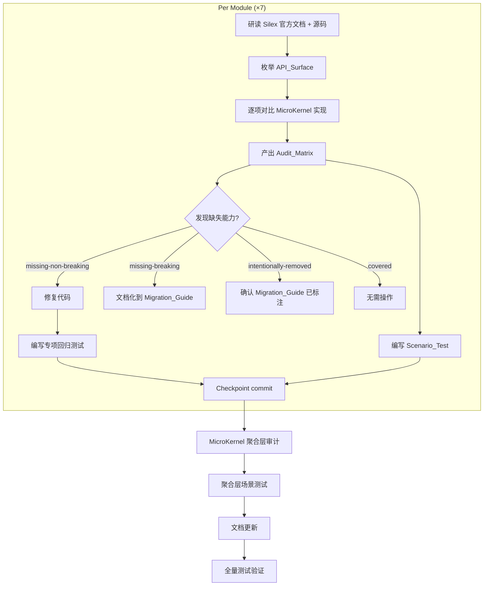

# Design Document

> Silex Migration Behavior Audit & Scenario Test Hardening — `.kiro/specs/release-3.3.0/`

---

## Overview

本设计文档描述 v3.3.0 行为审计与场景测试加固的技术方案。核心工作分三层：

1. **Audit_Matrix 生成**：对 7 个模块 + MicroKernel 聚合层，基于 Silex 官方文档和 GitHub 源码存档，逐项对比 API_Surface 覆盖情况，产出细粒度 Audit_Matrix（每个模块一张表，行为 Silex 的每个具体 API 方法/配置项/事件）
2. **Scenario_Test 补充**：为每个模块编写从用户场景出发的行为测试（boot → 配置 → 请求 → 验证响应），建立行为基准
3. **缺失能力修复 + 回归测试**：审计发现的 missing-non-breaking 能力直接补回代码，并编写独立的专项回归测试

**CR 决策体现**：

| CR 问题 | 决策 | 设计体现 |
|---------|------|----------|
| Q1=A | 每个模块一个独立测试类，放在 `ut/` 对应子目录 | 见 [测试目录结构](#测试目录结构) |
| Q2=B | 细粒度 Audit_Matrix | 见 [Audit_Matrix 模板](#audit_matrix-模板) |
| Q3=C | 提取轻量级 base test case 类 | 见 [ScenarioTestCase 基类](#scenariotestcase-基类) |
| Q4=B | 修复需要额外专项回归测试 | 见 [回归测试策略](#回归测试策略) |

**审计模块与风险排序**：Security → Routing → Middleware → CORS → Error Handling → Twig → Cookie → MicroKernel 聚合层

---

## Architecture

### 整体工作流



### 请求处理 Pipeline（审计基准）

审计需验证以下 pipeline 顺序与 Silex 时代的等价性：

```
MicroKernel::run()
  └─ handle(Request)
       ├─ ELB/CloudFront trusted proxy 处理
       ├─ KernelEvents::REQUEST (按 priority 降序)
       │    ├─ Routing (priority 32)
       │    ├─ CORS preflight (priority 20)
       │    ├─ Firewall 认证 (priority 8)
       │    ├─ Access rule 授权 (priority 7)
       │    └─ 用户 before middleware (priority 由用户指定)
       ├─ Controller 执行 (参数通过 ExtendedArgumentValueResolver 注入)
       ├─ KernelEvents::VIEW → View Handler 链
       ├─ KernelEvents::EXCEPTION → Error Handler 链
       └─ KernelEvents::RESPONSE → after middleware + Cookie 写入
```

---

## Components and Interfaces

### ScenarioTestCase 基类

根据 CR Q3=C 决策，提取一个轻量级 base test case 类，封装 boot + handle + assert 的通用流程。

**文件位置**：`ut/Helpers/ScenarioTestCase.php`

**设计要点**：

- 继承 `PHPUnit\Framework\TestCase`（不继承 `WebTestCase`，避免引入 `createApplication()` 约束）
- 封装 `buildKernel(array $config, bool $isDebug = false): MicroKernel` — 构造并返回 MicroKernel 实例
- 封装 `handleRequest(MicroKernel $kernel, string $method, string $uri, array $parameters = [], array $server = []): Response` — boot + 构造 Request + handle + 返回 Response
- 封装 `assertJsonResponse(Response $response, int $expectedStatus): array` — 断言状态码 + 解析 JSON body
- 封装 `assertStatusCode(Response $response, int $expectedStatus): void` — 仅断言状态码
- 提供 `createRoutingConfig(string $routesFile): array` — 生成最小 routing 配置
- 提供 `createTempCacheDir(): string` — 创建临时缓存目录（复用 `RouteCacheCleaner` trait 的模式）
- `tearDown()` 中自动 shutdown kernel 并清理缓存

```php
abstract class ScenarioTestCase extends TestCase
{
    protected ?MicroKernel $kernel = null;

    protected function buildKernel(array $config, bool $isDebug = false): MicroKernel
    {
        $this->kernel = new MicroKernel($config, $isDebug);
        return $this->kernel;
    }

    protected function handleRequest(
        MicroKernel $kernel,
        string $method,
        string $uri,
        array $parameters = [],
        array $server = [],
    ): Response {
        $kernel->boot();
        $request = Request::create($uri, $method, $parameters, [], [], $server);
        return $kernel->handle($request);
    }

    protected function assertJsonResponse(Response $response, int $expectedStatus): array
    {
        $this->assertSame($expectedStatus, $response->getStatusCode());
        $data = json_decode($response->getContent(), true);
        $this->assertIsArray($data);
        return $data;
    }

    protected function assertStatusCode(Response $response, int $expectedStatus): void
    {
        $this->assertSame($expectedStatus, $response->getStatusCode());
    }

    protected function tearDown(): void
    {
        if ($this->kernel !== null) {
            $this->kernel->shutdown();
        }
        $this->kernel = null;
    }
}
```

### 测试目录结构

根据 CR Q1=A 决策，每个模块一个独立测试类，放在 `ut/` 对应子目录中：

```
ut/
├── Helpers/
│   └── ScenarioTestCase.php          # 新增：base test case 类
├── Security/
│   └── SecurityScenarioTest.php      # 新增：R2 场景测试
├── Routing/
│   └── RoutingScenarioTest.php       # 新增：R4 场景测试
├── Middlewares/
│   └── MiddlewareScenarioTest.php    # 新增：R6 场景测试
├── Cors/
│   └── CorsScenarioTest.php         # 新增：R8 场景测试
├── ErrorHandlers/
│   └── ErrorHandlerScenarioTest.php  # 新增：R10 场景测试
├── Twig/
│   └── TwigScenarioTest.php         # 新增：R12 场景测试
├── Cookie/
│   └── CookieScenarioTest.php       # 新增：R14 场景测试
└── Integration/
    └── MicroKernelAggregationScenarioTest.php  # 新增：R16 场景测试
```

### 回归测试策略

根据 CR Q4=B 决策，审计发现的 missing-non-breaking 能力修复后，需要额外的专项回归测试，独立于场景测试。

**组织方式**：

- 回归测试文件命名：`{Module}FixRegressionTest.php`，放在对应模块的 `ut/` 子目录中
- 每个修复对应一个或多个测试方法，方法名包含修复的能力描述
- 回归测试聚焦于修复本身的正确性，不重复场景测试的覆盖范围
- 如果审计未发现需要修复的能力，则该模块不产出回归测试文件

**示例**：

```
ut/Security/
├── SecurityScenarioTest.php          # 场景测试（R2）
└── SecurityFixRegressionTest.php     # 修复回归测试（R1-AC3 驱动，如有修复）
```

---

## Data Models

### Audit_Matrix 模板

根据 CR Q2=B 决策，采用细粒度 Audit_Matrix：每个模块一张表，行为 Silex 的每个具体 API 方法/配置项/事件，列为覆盖状态、当前对应实现、处置决策。

**列定义**：

| 列 | 说明 |
|----|------|
| Silex API_Surface Item | Silex 时代的具体 API 方法、配置项、事件或隐含行为 |
| Category | 功能类别（如 firewall、authentication、access_rule） |
| Coverage Status | `covered` / `missing-non-breaking` / `missing-breaking` / `intentionally-removed` |
| Current Implementation | 当前 MicroKernel 中的对应实现（类名::方法名 或 "N/A"） |
| Disposition | 处置决策：`no-action` / `fix-code` / `document-only` / `confirm-documented` |
| Notes | 补充说明（如修复 PR、文档位置等） |

**模板示例（Security 模块）**：

| Silex API_Surface Item | Category | Coverage Status | Current Implementation | Disposition | Notes |
|------------------------|----------|-----------------|----------------------|-------------|-------|
| `$app->register(new SecurityServiceProvider())` | registration | covered | `SimpleSecurityProvider::register()` | no-action | — |
| `$app['security.firewalls']` 配置 | firewall | covered | `SecurityConfiguration` + `SimpleSecurityProvider::addFirewall()` | no-action | — |
| `pre_auth` policy type | authentication | covered | `AbstractSimplePreAuthenticationPolicy` | no-action | — |
| `http` policy type | authentication | covered | 需审计确认 | — | — |
| `form` policy type | authentication | intentionally-removed | N/A | confirm-documented | 需确认 Migration_Guide |
| `anonymous` policy type | authentication | 需审计确认 | — | — | — |
| `$app['security.role_hierarchy']` | role_hierarchy | covered | `SimpleSecurityProvider::addRoleHierarchy()` | no-action | — |
| `AuthenticatedVoter` 自动注册 | authentication | covered | `SimpleSecurityProvider::register()` | no-action | ISS-3.2-L01 已修复 |
| Token storage | authentication | covered | `TokenStorageInterface` | no-action | — |
| Entry point behavior | authentication | covered | `NullEntryPoint` | no-action | — |

> 注：以上为模板示例，实际内容在审计执行阶段填充。每个模块的 Audit_Matrix 记录在 tasks 执行过程中产出，最终汇总到 `docs/changes/3.3/` 目录下。


### 各模块 Audit_Matrix 审计范围

以下列出每个模块需要枚举的 Silex API_Surface 项，作为审计执行的 checklist。

#### Security 模块（R1）

| Category | 需枚举的 Silex API_Surface 项 |
|----------|-------------------------------|
| registration | `SecurityServiceProvider::register()` 自动注册的所有组件 |
| firewall | firewall 注册、URL pattern 匹配、多 firewall 配置、stateless 模式 |
| authentication | `pre_auth` / `http` / `form` / `anonymous` 四种 policy type |
| authentication | `AuthenticatorInterface` 链：`supports()` → `authenticate()` → `createToken()` |
| authentication | `TokenStorage` 生命周期、`PostAuthenticationToken` 创建 |
| authentication | `AuthenticatedVoter` 自动注册（ISS-3.2-L01 相关） |
| access_rule | access rule 注册、URL pattern 匹配、注册顺序优先、角色检查 |
| role_hierarchy | `RoleHierarchy` + `RoleHierarchyVoter` 配置 |
| entry_point | `NullEntryPoint` 行为、未认证时的异常类型 |
| implicit | 组件自动注册（`AccessDecisionManager`、`AuthenticatedVoter`、`RoleHierarchyVoter`） |

#### Routing 模块（R3）

| Category | 需枚举的 Silex API_Surface 项 |
|----------|-------------------------------|
| loading | YAML route loading、`FileLocator` 配置、`InheritableYamlFileLoader` |
| parameters | route parameter replacement（`%param%`）、namespace prefix |
| caching | route caching（`CacheableRouter`）、cache_dir 配置、cached matcher 复用 |
| matching | URL matching、redirectable matching、`GroupUrlMatcher` 双层架构 |
| generation | URL generation、`GroupUrlGenerator` |
| manipulation | `RouteCollection` 操作、`addRoute()` / `addRoutes()` 编程式注入 |
| freeze | boot 后路由冻结（`FrozenRouteCollection`）、`LogicException` |
| inheritable | inheritable route loading、namespace prefix handling |

#### Middleware 模块（R5）

| Category | 需枚举的 Silex API_Surface 项 |
|----------|-------------------------------|
| registration | `before()` / `after()` callback 注册（Silex `Application::before/after`） |
| interface | `MiddlewareInterface` 契约、`AbstractMiddleware` 基类 |
| priority | priority ordering、`EARLY_EVENT` / `LATE_EVENT` 常量映射 |
| filtering | master-request-only filtering（`onlyForMasterRequest()`） |
| short_circuit | before middleware 返回 Response 时的短路行为 |
| after | after middleware 修改 Response 的能力 |
| exception | middleware 抛异常时的 Error_Handler_Chain 交互 |

#### CORS 模块（R7）

| Category | 需枚举的 Silex API_Surface 项 |
|----------|-------------------------------|
| preflight | preflight 检测（`OPTIONS` + `Access-Control-Request-Method`）、preflight response 生成 |
| headers | `Access-Control-Allow-Origin` / `Allow-Methods` / `Allow-Headers` / `Expose-Headers` / `Max-Age` 处理 |
| strategy | strategy matching by URL pattern、多策略配置 |
| origin | origin validation、wildcard origin（`*`） |
| credentials | `Access-Control-Allow-Credentials` 支持 |
| interaction | 与 Security firewall 的交互（preflight 绕过 firewall） |
| exception | `MethodNotAllowed` exception handling for OPTIONS requests |

#### Error Handling 模块（R9）

| Category | 需枚举的 Silex API_Surface 项 |
|----------|-------------------------------|
| registration | `error()` callback 注册（Silex `Application::error()`） |
| chain | error handler chain 执行顺序、注册顺序优先 |
| short_circuit | handler 返回 Response 时的短路行为 |
| passthrough | handler 返回 null 时的传递行为 |
| conversion | exception-to-response 转换、`ExceptionListenerWrapper` 行为 |
| http_exception | HTTP exception status code 保留 |
| fallback | `FallbackViewHandler` error rendering |

#### Twig 模块（R11）

| Category | 需枚举的 Silex API_Surface 项 |
|----------|-------------------------------|
| initialization | `TwigEnvironment` 初始化、`FilesystemLoader` 配置 |
| config | template path、cache_dir、strict_variables、auto_reload |
| access | `getTwig()` 访问、Twig 未配置时返回 null |
| globals | `http` global（kernel 自身）、用户自定义 globals |
| functions | `asset()` function、`is_granted()` function |
| class_migration | Twig 3.x class name migration（`Twig_Environment` → `\Twig\Environment`） |

#### Cookie 模块（R13）

| Category | 需枚举的 Silex API_Surface 项 |
|----------|-------------------------------|
| container | `ResponseCookieContainer` 注入到 controller |
| writing | cookie 写入 response headers（`KernelEvents::RESPONSE`） |
| lifecycle | cookie container 每请求生命周期 |
| injection | `SimpleCookieProvider` 作为 `EventSubscriberInterface` 注册 |

#### MicroKernel 聚合层（R15）

| Category | 需枚举的 Silex API_Surface 项 |
|----------|-------------------------------|
| public_api | `run()`, `handle()`, `isGranted()`, `getToken()`, `getUser()`, `getTwig()`, `getParameter()`, `addExtraParameters()`, `addControllerInjectedArg()`, `addMiddleware()`, `addRoute()`, `addRoutes()`, `getCacheDirectories()` |
| pipeline | 请求处理 pipeline 顺序验证 |
| bootstrap_config | 所有 Bootstrap_Config key 的完整性和行为一致性 |
| cross_module | Security + CORS 交互、Security + Middleware 排序、Error Handler + View Handler 优先级 |

---

## Error Handling

### 审计过程中的错误处理

- **Silex 文档不完整**：如果 Silex 官方文档对某个 API_Surface 项描述不充分，以 Silex GitHub 源码为准。在 Audit_Matrix 的 Notes 列标注 "source-based"
- **Coverage Status 判定模糊**：如果无法明确判定 covered 还是 missing，标注为 "needs-verification" 并在场景测试中增加针对性验证
- **修复引入新问题**：回归测试（CR Q4=B）的目的就是捕获修复引入的新问题。回归测试必须在修复代码提交前编写（test-first）

### 场景测试中的错误处理

- 场景测试中预期的异常（如 `AccessDeniedHttpException`、`LogicException`）使用 `$this->expectException()` 断言
- 场景测试中非预期的异常应导致测试失败，不做 catch
- 涉及缓存的测试（Routing cache）在 `setUp()` / `tearDown()` 中清理缓存目录，避免测试间干扰

---

## Testing Strategy

### PBT 适用性评估

本 spec 的核心工作是行为审计和场景级集成测试，不涉及纯函数或数据转换逻辑。场景测试的本质是 integration test（boot → request → response），不适合 property-based testing：

- 审计类 requirement（R1/R3/R5/R7/R9/R11/R13/R15）的 AC 是过程性的（enumerate → compare → classify → dispose），不是可自动化测试的属性
- 测试类 requirement（R2/R4/R6/R8/R10/R12/R14/R16）的 AC 是具体场景的集成测试，每个测试有明确的配置 → 请求 → 断言流程，不是 "for all inputs" 的通用属性
- 文档类 requirement（R17）不可自动化测试

因此，**本 spec 不包含 Correctness Properties section**，测试策略仅包含场景级集成测试和专项回归测试。

### 测试分层

| 层 | 目的 | 数量预估 | 工具 |
|----|------|----------|------|
| Scenario Test | 从用户场景出发验证行为等价性 | 每模块 3~8 个测试方法 | PHPUnit + `ScenarioTestCase` |
| Fix Regression Test | 验证修复的正确性，防止修复引入新问题 | 取决于审计发现 | PHPUnit + `ScenarioTestCase` |
| 现有 Unit Test | 保持不变，验证实现内部逻辑 | 650 tests（现有） | PHPUnit |
| 现有 PBT | 保持不变，验证通用属性 | 13 个 PBT 文件（现有） | PHPUnit + Eris |

### 各模块场景测试设计

#### Security 场景测试（R2）— `ut/Security/SecurityScenarioTest.php`

| AC | 测试方法 | 配置要点 | 断言要点 |
|----|----------|----------|----------|
| 2.1 | `testCompleteAuthenticationFlow` | firewall with pre_auth policy | `getToken()` 返回 `PostAuthenticationToken`，`getUser()` 返回认证用户 |
| 2.2 | `testAuthenticationFailure` | firewall + invalid credentials | token 为 null，access rule 决定结果 |
| 2.3 | `testIsGrantedWithVariousAttributes` | firewall + role_hierarchy | `isGranted('IS_AUTHENTICATED_FULLY')`、`isGranted('ROLE_ADMIN')`、角色继承 |
| 2.4 | `testMultipleFirewallConfiguration` | 两个 firewall 不同 URL pattern | 各 firewall 仅匹配自己的 pattern |
| 2.5 | `testMultipleAccessRuleOrdering` | 多条 access rule 不同 pattern/role | 按注册顺序匹配，第一条匹配生效 |
| 2.6 | `testUnauthenticatedAccessToProtectedResource` | firewall + access rule | `AccessDeniedHttpException` → 403 |
| 2.7 | `testStatelessFirewallBehavior` | stateless firewall | 无 session 交互 |

#### Routing 场景测试（R4）— `ut/Routing/RoutingScenarioTest.php`

| AC | 测试方法 | 配置要点 | 断言要点 |
|----|----------|----------|----------|
| 4.1 | `testYamlRouteLoadingAndMatching` | `routing.path` 指向 YAML | 正确 controller 被调用，返回预期 response |
| 4.2 | `testProgrammaticRouteInjection` | `addRoute()` before boot | 注入的路由可匹配 |
| 4.3 | `testMixedRoutingPriority` | YAML + `addRoute()` 路径重叠 | 编程式路由优先 |
| 4.4 | `testRouteParameterReplacement` | route with `%param%` | 解析后使用替换值 |
| 4.5 | `testBootAfterRouteFreeze` | boot → `addRoute()` | `LogicException` |
| 4.6 | `testBootAfterRouteCollectionFreeze` | boot → `getRouter()->getRouteCollection()->add()` | `LogicException` |
| 4.7 | `testRouteCacheBehavior` | `cache_dir` 配置 | cached matcher 创建 → 复用 |
| 4.8 | `testUndefinedRoute` | 请求未定义路径 | 404 response |

#### Middleware 场景测试（R6）— `ut/Middlewares/MiddlewareScenarioTest.php`

| AC | 测试方法 | 配置要点 | 断言要点 |
|----|----------|----------|----------|
| 6.1 | `testBeforeMiddlewareExecution` | before middleware | middleware 在 controller 前执行 |
| 6.2 | `testAfterMiddlewareExecution` | after middleware | middleware 在 controller 后执行，可修改 response |
| 6.3 | `testMiddlewarePriorityOrdering` | 多个 before middleware 不同 priority | 按 priority 降序执行 |
| 6.4 | `testBeforeMiddlewareShortCircuit` | before middleware 返回 Response | controller 不执行 |
| 6.5 | `testMasterRequestOnlyFiltering` | `onlyForMasterRequest() = true` | main request 执行，sub-request 不执行 |
| 6.6 | `testMiddlewareExceptionBehavior` | before middleware 抛异常 | Error_Handler_Chain 被调用 |

#### CORS 场景测试（R8）— `ut/Cors/CorsScenarioTest.php`

| AC | 测试方法 | 配置要点 | 断言要点 |
|----|----------|----------|----------|
| 8.1 | `testPreflightRequestHandling` | CORS strategy | OPTIONS → `Access-Control-Allow-*` headers |
| 8.2 | `testNormalCorsRequest` | CORS strategy | GET → `Access-Control-Allow-Origin` header |
| 8.3 | `testMultipleCorsStrategyMatching` | 两个 strategy 不同 URL pattern | 各 strategy 仅匹配自己的 pattern |
| 8.4 | `testCorsWithCredentials` | `credentials = true` | `Access-Control-Allow-Credentials: true` |
| 8.5 | `testCorsAndSecurityInteraction` | CORS + Security | preflight 不触发认证 |
| 8.6 | `testNonMatchingOrigin` | 不在 allowed list 的 origin | 无 `Access-Control-Allow-Origin` header |

#### Error Handling 场景测试（R10）— `ut/ErrorHandlers/ErrorHandlerScenarioTest.php`

| AC | 测试方法 | 配置要点 | 断言要点 |
|----|----------|----------|----------|
| 10.1 | `testCustomErrorHandler` | `error_handlers` 配置 | handler 接收异常，返回自定义 Response |
| 10.2 | `testErrorHandlerChainOrdering` | 多个 error handler | 按注册顺序调用，第一个返回 Response 的短路 |
| 10.3 | `testErrorHandlerPassthrough` | handler 返回 null | 异常传递到下一个 handler 或默认处理 |
| 10.4 | `testHttpExceptionStatusCodePreservation` | 抛 `HttpException(403)` | response status = 403 |
| 10.5 | `testFallbackViewHandlerErrorRendering` | 无自定义 error handler | `FallbackViewHandler` 产出 response |

#### Twig 场景测试（R12）— `ut/Twig/TwigScenarioTest.php`

| AC | 测试方法 | 配置要点 | 断言要点 |
|----|----------|----------|----------|
| 12.1 | `testTwigTemplateRendering` | twig config + template path | response body 包含渲染内容 |
| 12.2 | `testTwigAbsence` | 无 `twig` key | `getTwig()` 返回 null |
| 12.3 | `testTwigStrictVariablesMode` | `strict_variables = true` | 引用未定义变量抛异常 |
| 12.4 | `testTwigAutoReloadBehavior` | `auto_reload` 配置 | Twig environment 反映配置值 |

#### Cookie 场景测试（R14）— `ut/Cookie/CookieScenarioTest.php`

| AC | 测试方法 | 配置要点 | 断言要点 |
|----|----------|----------|----------|
| 14.1 | `testCookieWriting` | controller 添加 cookie | response `Set-Cookie` header 包含 cookie |
| 14.2 | `testResponseCookieContainerInjection` | `SimpleCookieProvider` 配置 | `ResponseCookieContainer` 可作为 controller 参数 |
| 14.3 | `testMultipleCookies` | controller 添加多个 cookie | 所有 cookie 出现在 response headers |

#### MicroKernel 聚合层场景测试（R16）— `ut/Integration/MicroKernelAggregationScenarioTest.php`

| AC | 测试方法 | 配置要点 | 断言要点 |
|----|----------|----------|----------|
| 16.1 | `testFullPipelineTraversal` | routing + security + CORS + middleware + view handler + error handler | 完整 pipeline 产出预期 response |
| 16.2 | `testMinimalConfiguration` | 仅 `routing` config | 基本 request-response 正常 |
| 16.3 | `testNoOptionalModules` | 无 security/cors/twig | kernel 正常运行 |
| 16.4 | `testAddControllerInjectedArg` | 注册自定义对象 | controller 可获取该对象 |
| 16.5 | `testAddExtraParameters` | 添加 extra parameters | `getParameter()` 返回添加的值 |
| 16.6 | `testSlowRequestDetection` | controller 超过慢请求阈值 | 慢请求日志行为 |

### 场景测试辅助资源

每个模块的场景测试可能需要以下辅助资源：

| 资源类型 | 位置 | 用途 |
|----------|------|------|
| YAML routes 文件 | `ut/{Module}/scenario.routes.yml` | 场景测试专用路由定义 |
| Twig 模板文件 | `ut/Twig/templates/scenario/` | Twig 场景测试专用模板 |
| Test Controller | `ut/Helpers/Controllers/ScenarioController.php` | 场景测试专用 controller（如需要） |
| Test Middleware | `ut/Helpers/Middlewares/` | 场景测试专用 middleware 实现 |
| Test Authenticator | `ut/Helpers/Security/` | 场景测试专用 authenticator 实现 |

### 文档更新策略（R17）

| 触发条件 | 更新目标 | 更新内容 |
|----------|----------|----------|
| 审计发现未文档化的 breaking change | `docs/manual/migration-v3.md` | 严重程度标记 + before/after 代码示例 + 迁移说明 |
| 审计发现架构文档不准确 | `docs/state/architecture.md` | 修正不准确的描述 |
| 所有审计完成 | `docs/manual/migration-v3.md` | 对照全部 Audit_Matrix 结果做完整性 review |
| 文档更新 | 遵循 writing conventions | 中文行文 + 英文术语 + backtick 包裹代码引用 + 表格格式 |

---

## Impact Analysis

### 受影响的 State 文档

| 文档 | 影响 Section | 影响类型 |
|------|-------------|----------|
| `docs/state/architecture.md` | 如审计发现描述不准确之处 | 修正（R17-AC2） |
| `docs/manual/migration-v3.md` | 如审计发现未文档化的 breaking change | 补充（R17-AC1） |

### 现有行为变化

- **代码行为**：审计发现的 missing-non-breaking 能力将被修复，恢复到 Silex 时代的等价行为。修复不改变现有公开 API 签名，下游消费者无需修改代码
- **测试行为**：新增 `ScenarioTestCase` 基类和各模块场景测试文件，不影响现有测试的执行

### 数据模型变更

不涉及。本 spec 不修改任何数据模型、配置 schema 或持久化格式。

### 外部系统交互

不涉及。审计和测试工作完全在本仓库内部进行，不涉及外部系统交互变化。

### 配置项变更

不涉及新增、删除或默认值变化。审计可能发现某些 Bootstrap_Config key 的处理行为与文档不一致，此类问题按 R17 处置（修正文档或修复代码），但不引入新的配置项。

### 测试基础设施变更

| 变更 | 说明 |
|------|------|
| 新增 `ut/Helpers/ScenarioTestCase.php` | 场景测试基类，所有模块场景测试继承 |
| 新增 8 个 `*ScenarioTest.php` 文件 | 分布在 `ut/` 各模块子目录 |
| 可能新增 `*FixRegressionTest.php` 文件 | 取决于审计发现，仅在有 missing-non-breaking 修复时产出 |
| 新增辅助资源 | `scenario.routes.yml`、测试用 controller/middleware/authenticator 等 |

### Graphify 辅助验证

基于 graphify 社区结构确认：
- `MicroKernel`（42 edges, betweenness 0.253）是核心 god node，审计聚合层（R15）的必要性得到图结构验证
- 各模块对应的 graphify community（Security Auth Controllers、Cacheable Router URL Matching、Kernel Handle & Middleware Chain、CORS Advanced Testing、Data Provider & Cookie Container 等）与 design 的模块划分一致，无遗漏的跨 community 依赖
- 现有 Cross-Community Integration Tests（community 19）与 design 中 `ut/Integration/` 的定位一致

---

## Socratic Review

**Q: 为什么 ScenarioTestCase 不继承 WebTestCase？**
A: `WebTestCase` 要求实现 `createApplication()` 并在 `setUp()` 中自动调用，这对场景测试不够灵活——场景测试需要在每个测试方法中构造不同配置的 MicroKernel。`ScenarioTestCase` 直接继承 `TestCase`，通过 `buildKernel()` 方法在测试方法内按需构造，更符合场景测试的使用模式。

**Q: Audit_Matrix 记录在哪里？**
A: Audit_Matrix 作为审计过程产物，在 tasks 执行阶段逐模块产出。最终汇总记录在 `docs/changes/3.3/` 目录下（作为 release 变更记录的一部分）。长期价值由场景测试承载，Audit_Matrix 本身不需要持续维护。

**Q: 回归测试与场景测试的边界是什么？**
A: 场景测试验证"用户场景下的行为正确性"（R2/R4/R6/R8/R10/R12/R14/R16 的 AC），是行为基准。回归测试验证"修复本身的正确性"（R1/R3/R5/R7/R9/R11/R13 的 AC3 驱动），聚焦于修复引入的变更不破坏其他行为。两者互补：场景测试覆盖面广但粒度粗，回归测试覆盖面窄但粒度细。

**Q: 如果审计未发现任何缺失能力，回归测试文件是否仍需创建？**
A: 不需要。回归测试文件仅在审计发现 missing-non-breaking 能力并修复后才创建。如果某模块审计结果全部为 covered 或 intentionally-removed，则该模块不产出回归测试文件。

**Q: 场景测试是否会与现有集成测试重复？**
A: 可能存在部分重叠（如 `SecurityAuthenticationFlowIntegrationTest` 已覆盖部分 R2 的 AC），但视角不同。现有集成测试从实现出发验证实现，场景测试从 Silex 行为基准出发验证等价性。在实现阶段，如果发现某个 AC 已被现有测试充分覆盖，可以在场景测试中标注引用而非重复编写，但场景测试类本身仍需创建以保持结构完整性。

**Q: 为什么 MicroKernel 聚合层场景测试放在 `ut/Integration/` 而不是单独目录？**
A: MicroKernel 聚合层测试本质上是跨模块集成测试，放在 `ut/Integration/` 与现有的 `SilexKernelCrossCommunityIntegrationTest` 等文件保持一致。

**Q: 设计是否覆盖了所有 17 个 requirement？**
A: 是。R1/R3/R5/R7/R9/R11/R13（审计类）通过 Audit_Matrix 模板和审计范围 checklist 覆盖。R2/R4/R6/R8/R10/R12/R14/R16（测试类）通过各模块场景测试设计覆盖。R15（聚合层审计）通过 MicroKernel 聚合层审计范围覆盖。R17（文档更新）通过文档更新策略覆盖。

**Q: 细粒度 Audit_Matrix（Q2=B）的工作量是否过大？**
A: 细粒度确实增加了审计工作量，但这是用户的明确决策。细粒度的价值在于：每个具体 API 方法/配置项都有明确的覆盖状态记录，不会遗漏隐含行为（如 `AuthenticatedVoter` 自动注册这类问题正是因为粗粒度审计遗漏的）。审计执行时可以借助 Silex 源码的 class/method 列表系统性枚举，降低遗漏风险。

---

## Gatekeep Log

**校验时间**: 2025-07-15
**校验结果**: ⚠️ 已修正后通过

### 修正项
- [结构] 补充 `## Impact Analysis` section——steering 要求 design 必须包含影响分析，原文档缺失。补充了受影响的 state 文档、行为变化、数据模型、外部系统、配置项、测试基础设施变更等维度，并利用 graphify 社区结构辅助验证模块划分一致性
- [内容] `ScenarioTestCase::tearDown()` 中 `$this->kernel instanceof Kernel` 修正为 `$this->kernel !== null`——属性类型已声明为 `?MicroKernel`，使用 `!== null` 更清晰且与属性类型一致

### 合规检查
- [x] 无 TBD / TODO / 待定 / 占位符
- [x] 无空 section 或不完整的列表
- [x] 内部引用一致（R1-R17 编号、CR Q1-Q4 引用、术语引用均与 requirements.md 一致）
- [x] 代码块语法正确（PHP、Mermaid、Markdown 表格均正确闭合）
- [x] 无 markdown 格式错误
- [x] 一级标题存在且正确
- [x] 技术方案主体存在（Architecture + Components and Interfaces + Data Models），承接了 requirements 中的 17 条需求
- [x] 接口签名 / 数据模型有明确定义（`ScenarioTestCase` 完整代码、Audit_Matrix 列定义和模板、测试目录结构、回归测试策略）
- [x] 各 section 之间使用 `---` 分隔
- [x] 每条 requirement 在 design 中都有对应的实现描述（审计类 → Audit_Matrix 审计范围 checklist，测试类 → 场景测试设计表，文档类 → 文档更新策略）
- [x] 无遗漏的 requirement
- [x] design 中的方案不超出 requirements 的范围
- [x] Impact Analysis 覆盖受影响的 state 文档、行为变化、数据模型、外部系统、配置项、测试基础设施
- [x] 利用 graphify 查询结果辅助验证了模块划分和跨 community 依赖
- [x] 技术选型有明确理由（ScenarioTestCase 不继承 WebTestCase 的理由、细粒度 Audit_Matrix 的价值）
- [x] 接口签名足够清晰，能让 task 独立执行
- [x] 模块间依赖关系清晰，无循环依赖（graphify 验证）
- [x] 无过度设计
- [x] 与 `docs/state/architecture.md` 描述的现有架构一致
- [x] Socratic Review 覆盖充分（8 个 Q&A）
- [x] Requirements CR 决策（Q1=A, Q2=B, Q3=C, Q4=B）均在 design 中明确体现
- [x] 技术选型明确，无含糊选型
- [x] 接口定义可执行
- [x] Requirements 全覆盖（17/17）
- [x] Impact 充分评估
- [x] 可 task 化——按模块划分，每个模块的审计 + 测试可独立拆为 task

### Clarification Round

**状态**: 已回答

**Q1:** Task 拆分粒度——每个模块的审计（奇数 R）和场景测试（偶数 R）应如何拆分为 task？

审计和测试在 requirements 中是独立的 requirement，但在执行时高度耦合（审计发现驱动测试设计，修复需要回归测试）。拆分方式会影响 checkpoint commit 的粒度和并行性。

- A) 每个模块一个 task（审计 + 场景测试 + 修复 + 回归测试合并为一个 task），共 8 个模块 task + 1 个文档 task = 9 tasks
- B) 每个模块拆为两个 task（审计+修复 为一个 task，场景测试+回归测试 为另一个 task），共 16 个模块 task + 1 个文档 task = 17 tasks
- C) 按阶段拆分：先全部审计（1 个大 task），再全部测试（1 个大 task），最后文档更新（1 个 task）= 3 tasks
- D) 其他（请说明）

**A:** A — 每个模块一个 task（审计 + 场景测试 + 修复 + 回归测试合并），共 8 个模块 task + 1 个文档 task = 9 tasks

**Q2:** ScenarioTestCase 基类的实现时机——基类是所有场景测试的前置依赖，需要决定何时实现。

- A) 作为第一个独立 task 实现（在所有模块 task 之前），确保后续模块 task 可直接使用
- B) 在第一个模块 task（Security）中一并实现，后续模块 task 复用
- C) 先用最小实现（仅 `buildKernel` + `handleRequest`）启动，随模块推进逐步扩展方法
- D) 其他（请说明）

**A:** B — 在第一个模块 task（Security）中一并实现，后续模块 task 复用

**Q3:** Audit_Matrix 的产出位置——design 中提到"最终汇总到 `docs/changes/3.3/` 目录下"，但执行过程中的中间产物需要一个工作位置。

- A) 直接在 `docs/changes/3.3/` 下逐模块产出（如 `docs/changes/3.3/audit/security-audit-matrix.md`），无中间位置
- B) 先在 spec 目录（`.kiro/specs/release-3.3.0/`）下产出，全部完成后移动到 `docs/changes/3.3/`
- C) 在 task 执行过程中以 commit message 或 PR description 记录，不单独产出文件，仅在最终 CHANGELOG 中汇总关键发现
- D) 其他（请说明）

**A:** B — 先在 spec 目录（`.kiro/specs/release-3.3.0/`）下产出，全部完成后移动到 `docs/changes/3.3/`

**Q4:** 现有测试与场景测试的重叠处理——design Socratic Review 提到"如果发现某个 AC 已被现有测试充分覆盖，可以在场景测试中标注引用而非重复编写"。需要明确执行标准。

- A) 严格不重复：如果现有测试已覆盖某个 AC 的核心断言，场景测试中仅添加 `@see` 注释引用现有测试，不编写重复测试方法
- B) 允许适度重复：即使现有测试已覆盖，场景测试仍编写独立的测试方法（从 Silex 行为基准视角），保持场景测试的完整性和独立性
- C) 按模块判断：高风险模块（Security、Routing）允许重复以确保覆盖，低风险模块（Twig、Cookie）优先引用现有测试
- D) 其他（请说明）

**A:** B+C — 允许适度重复保持场景测试完整性，同时按模块风险判断：高风险模块（Security、Routing）允许重复以确保覆盖，低风险模块（Twig、Cookie）优先引用现有测试
